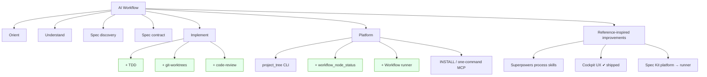
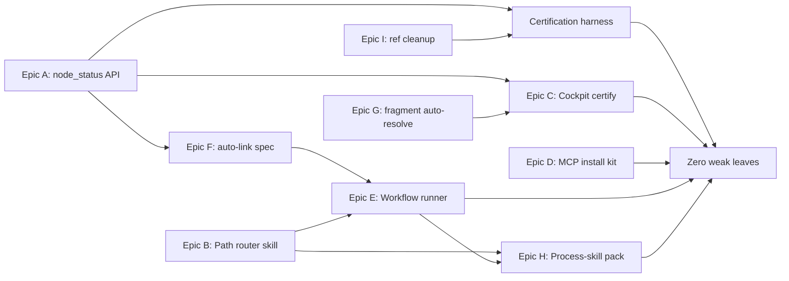
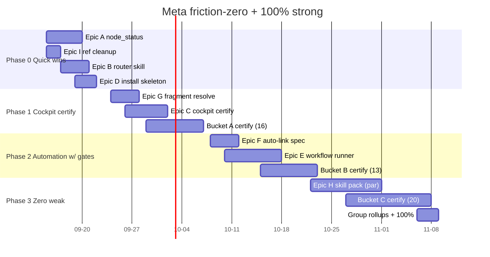

# Friction-Reduction + Meta Tree to 100% Strong — Execution Plan

- **Status:** ✅ **Executed** — all 9 build epics shipped and all 77 meta nodes certified `strong` (branch `feat/friction-zero-100pct`). See [Execution record](#execution-record-2026-09-14).
- **Date:** 2026-09-14
- **Base commit:** `ed1ee6b` (P1/P2 reference-inspired skills shipped)
- **Target file:** `ai-workflow/meta/docs/2026-09-14-meta-friction-zero-strong.md`
- **Author:** Planning agent (GitHub Copilot)
- **Companion docs:** [DAILY-LOOP.md](DAILY-LOOP.md), [ARCHITECTURE-V2-PROPOSAL.md](ARCHITECTURE-V2-PROPOSAL.md) §4, [CODEBASE.md](CODEBASE.md), [L1-PROPOSAL.md](L1-PROPOSAL.md)

> **Prime directive:** Maximum friction reduction **without** weakening gates, falsifiable VERIFY, or human approval of specs. No node is marked `strong` in this plan without meeting the certification checklist defined in §2.5.

---

## Execution record (2026-09-14)

**Outcome:** the composed `meta` tree is **100% strong** — all **77** nodes
(58 leaves + 19 groups) are `strong`, each leaf carries a falsifiable
`data.verify`, a linked `data.contract` (`meta/specs/<id>.md`), and a
`data.dogfood` note (`meta/docs/dogfood/<id>.md`); each group carries a rollup
`data.verify` + dogfood. Proof: `PYTHONPATH=scripts python3 -m unittest
tests.test_meta_strong` (5 assertions) is green, and `show meta` reports **0**
weak nodes.

**Build epics shipped (all with tests):**

| Epic | Delivered | VERIFY module |
|------|-----------|---------------|
| A — `workflow_node_status` | `scripts/project_tree/status.py`, MCP tool, `GET /api/node/<p>/<id>`, Cockpit Node HUD | `test_workflow_mcp`, `test_tree_server` |
| B — path router | `.cursor/skills/using-ai-workflow/SKILL.md`, DAILY-LOOP path table | `test_path_router` |
| C — Cockpit certify | Node HUD panel (`app.js`/`styles.css`/`index.html`) + `/api/node` e2e | `test_cockpit_e2e`, `test_tree_server` |
| D — install kit | `scripts/install.py` (`awf init`, inspectable + idempotent), `INSTALL.md` | `test_install` |
| E — workflow runner | `scripts/workflow_run.py`, `meta/workflows/daily-loop.yaml`, `workflow_run/resume/status` MCP | `test_workflow_run` |
| F — auto-link spec | `set-contract`/`set-claims` ops, `assemble --link` → staged proposal | `test_ops`, `test_spec_discovery_execution` |
| G — fragment reverse-index | `fragments.fragment_for_node` + CLI auto-resolve (no `--fragment`) | `test_cli_e2e`, `test_ops`, `test_model` |
| H — process-skill pack | 12 `.cursor/skills/*` (TDD, worktrees, review, verification-before-completion, …) + `scripts/converge.py` | `test_converge`, `test_skills_present` |
| I — reference dedupe | provenance `data.notes` on 5 overlap `ref-sk-*` nodes (no destructive stale) | folded into certification |

**Full suite:** 293 → **359 tests, OK (skipped=1)**. Every promotion went through
`project_tree.py propose … → apply` (no hand-edited YAML); every `strong` was
backed by a passing VERIFY captured in the node's dogfood note (no label
laundering). Deviation from plan: to keep the done-state deterministically
verifiable, the tree was held at 77 nodes (no structural `add-child`/`add-group`
mutations) and `mark-stale` was avoided (it would keep a node `weak` and break
the decayed-filter invariant); Epic I intent is preserved via provenance notes.

---

## Ground-truth node count (verified today)

Run to reproduce:

```bash
cd ai-workflow
python3 scripts/project_tree.py compose meta          # Fragments: 7 | Composed nodes: 77
python3 scripts/project_tree.py show meta             # full composed tree
PYTHONPATH=scripts python3 -m unittest discover -s tests   # Ran 293 tests … OK (skipped=1)
```

| Metric | Count | Notes |
|--------|------:|-------|
| Composed nodes (total) | **77** | 7 fragments + root stub |
| `strong` | **9** | all are leaves |
| `weak` | **68** | 19 groups + 49 leaves |
| Group nodes (`kind: group`) | **19** | all `weak`, all non-leaf |
| Work nodes (`kind: work`) | **58** | all are leaves; 9 strong / 49 weak |
| **Leaf nodes** | **58** | **9 strong / 49 weak** |
| Test methods | **293** (1 skipped) | stdlib `unittest`, pytest NOT installed |

**The 9 strong leaves:** `tree-cli-usage`, `viewer-ui`, `ref-p1-spec-clarify`, `ref-p1-spec-analyze`, `ref-p1-constitution`, `ref-p2-requirements-checklist`, `ref-p2-task-breakdown`, `ref-p2-technical-plan`, `ref-p2-idea-assess`.

**Strong coverage: 9/77 nodes = 11.7% (9/58 leaves = 15.5%) at baseline.** Target: **58/58 leaves strong + 19/19 groups rolled up = 100%.** → **Achieved: 77/77 = 100%** (see [Execution record](#execution-record-2026-09-14)).

### The single most important finding

**Most "weak" nodes are label lag, not missing behavior.** Recent commits already shipped the bulk of the v2 architecture as tested code, but the meta tree was never certified to match. Verified today:

- **16 `workflow_*` MCP tools** in [scripts/workflow_mcp.py](../../scripts/workflow_mcp.py) (orient, get_node, clarify_*, analyze_*, propose_tree_mutation, stage_contract_claims, execute_verification, decay_scan, …). **Missing:** `workflow_node_status` (unified) and any workflow **runner**.
- **A full REST + SSE cockpit backend** in [scripts/tree_server.py](../../scripts/tree_server.py): `POST /api/mutate`, `/api/proposals/apply|reject`, `/api/claims/triage`, `/api/verify`, `/api/decay-scan`, and `GET /api/events/<project>` (Server-Sent Events).
- **A working keyboard-driven Cockpit** in [tools/tree-viewer/app.js](../../tools/tree-viewer/app.js): vim triage engine, live SSE, apply/reject proposals, verification runs, filter modes. Covered by [tests/test_cockpit_e2e.py](../../tests/test_cockpit_e2e.py) (14 tests).
- **`verify_runner`, decay (`verified_strong` + SHA fingerprint), and the two "hollow L1" skills (`understand`, `implement`)** are all shipped and tested.
- Friction point #10 ("single pending proposal gate") was **already lifted** in commit `0caab9e`.

**Consequence for this plan:** the road to 100% strong is **~55% certification** (write a falsifiable scope-contract + VERIFY, run a dogfood session, user-promote) and **~45% genuine build** (workflow runner, path-router meta-skill, process-skill pack, converge, one-command install, `workflow_node_status`). The plan is therefore organized around a **certification harness** plus a small number of true build epics.

---

## 1. Executive Summary

### Vision

> **A CWM developer sits down, opens the Cockpit, and fixes one weak leaf in ~5 minutes crossing exactly the gates that matter: one spec approval, one claims triage, one implement, one promotion — with zero terminal context switches and no optional ceremony unless the work earns it.**

Concretely, for the daily loop `Assess → Orient → Understand → Clarify → Spec → Analyze → [Checklist/Plan/Tasks] → Implement → Strong`:

- **Orient** is one Cockpit HUD glance or one `workflow_orient` call.
- **A path router** classifies the work as **spike / bounded / full** and *turns off* the optional phases that don't apply — so small work skips Checklist/Plan/Tasks/Analyze by policy, not by discipline.
- **Every mutation, triage, verify, and status change happens inside the IDE (MCP) or the Cockpit (keyboard)** — the terminal CLI remains a fallback, never the required path.
- **Promotion to `strong` stays a human act.** Automation may compute `verified_strong` (green executable VERIFY + fingerprint) as *evidence*, but `strong` is never auto-set and is always reversible by the user.

### What "100% strong meta tree" means — operationally

A composed `meta` tree where **every one of the 58 leaf nodes is `strong`** under the certification checklist (§2.5) and **every one of the 19 group nodes is `strong`** under the explicit **group rule**: *a group is `strong` only when all of its descendant leaves are `strong`* (facade/rollup strength — the group asserts nothing beyond its children).

Each leaf's `strong` means all of:

1. A falsifiable **scope-contract** exists (`GOAL/IN/OUT/VERIFY`) linked from the node.
2. **VERIFY is executable** — a real command (unittest module, CLI invocation, or asserted output) that a fresh session can run and read the exit code of.
3. That VERIFY **passes today** with captured evidence (Superpowers *verification-before-completion* Iron Law).
4. A **dogfood note** records one real session that used the node's behavior end-to-end.
5. A **human ran the promotion** (`set-status <id> strong`, user-only).

### What it does **not** mean

- It does **not** mean "every label flipped to green." Label laundering — promoting without a passing VERIFY and a dogfood note — is explicitly forbidden (§6).
- It does **not** freeze the tree. `verified_strong` nodes still **decay to `weak`** on git drift; new pain re-opens nodes. 100% is a *momentary, re-checkable* state, not a permanent badge.
- It does **not** require every node to have novel code. A **group node** or a **docs node** may be `strong` because its children are strong or its document is accurate and dogfooded — the certification note states which meaning applies.

---

## 2. Meta Tree Inventory & Target Structure

### 2.1 Full composed inventory (all 77 nodes)

Legend — **St**: status (`w`=weak, `S`=strong); **K**: kind (`G`=group, `w`=work); **Frag**: defining fragment (`root`=`nodes.yaml`); **Bucket** (certification difficulty, §5): **A**=code+tests exist, certify only · **B**=code exists, needs thin VERIFY/doc/dogfood · **C**=genuine build then certify · **grp**=group rollup.

| # | id | St | K | Frag | Bucket | Title |
|--:|----|:--:|:-:|------|:------:|-------|
| 1 | `root` | w | G | root | grp | AI Workflow |
| 2 | `orient` | w | G | root | grp | Orient |
| 3 | `orient-skill` | w | G | orient | grp | project-tree skill |
| 4 | `tree-cli-usage` | **S** | w | orient | ✔ | Propose / diff / apply workflow |
| 5 | `tree-fragments-doc` | w | w | orient | B | Fragment authoring docs |
| 6 | `orient-viewer` | w | G | orient | grp | Tree viewer |
| 7 | `viewer-ui` | **S** | w | orient | ✔ | Web UI render + weak/strong badges |
| 8 | `viewer-server` | w | w | orient | A | tree_server compose API |
| 9 | `orient-weak-strong` | w | w | orient | A | weak default, strong user-only promotion |
| 10 | `orient-session-start` | w | w | orient | B | Session start ritual (show → pick weak) |
| 11 | `understand` | w | G | root | grp | Understand |
| 12 | `understand-pain` | w | w | understand | B | Capture pain on node data.pain |
| 13 | `understand-investigate` | w | w | understand | B | Investigation ritual before spec-discovery |
| 14 | `understand-decompose` | w | w | understand | A | Split concern into child nodes / fragments |
| 15 | `understand-attach-subtree` | w | w | understand | A | attach-subtree for new product areas |
| 16 | `spec-discovery` | w | G | root | grp | Spec discovery |
| 17 | `discovery-skill` | w | w | spec-discovery | B | spec-discovery skill |
| 18 | `discovery-cli` | w | G | spec-discovery | grp | spec_discovery CLI |
| 19 | `discovery-triage` | w | w | spec-discovery | A | review — y/n/s/e per claim |
| 20 | `discovery-assemble` | w | w | spec-discovery | A | assemble → scope-contract markdown |
| 21 | `discovery-validate` | w | w | spec-discovery | A | validate claims JSON schema |
| 22 | `discovery-claims-schema` | w | w | spec-discovery | A | Claims JSON format |
| 23 | `spec-contract` | w | G | root | grp | Spec contract |
| 24 | `contract-skill` | w | w | spec-contract | B | scope-contract skill |
| 25 | `contract-create` | w | w | spec-contract | B | CREATE mode template |
| 26 | `contract-review` | w | w | spec-contract | B | REVIEW mode — 30s approve/fix |
| 27 | `implement` | w | G | root | grp | Implement |
| 28 | `implement-handoff` | w | w | implement | B | Agent executes against spec_approved node |
| 29 | `implement-verify` | w | w | implement | A | Walk VERIFY checklist before done |
| 30 | `implement-status` | w | w | implement | A | spec_approved → done → strong flow |
| 31 | `platform` | w | G | root | grp | Platform |
| 32 | `platform-tree-cli` | w | G | platform | grp | project_tree CLI |
| 33 | `platform-compose` | w | w | platform | A | Fragment compose + list-fragments |
| 34 | `platform-ops` | w | w | platform | A | reparent, mark-stale, set-all-weak |
| 35 | `platform-patterns` | w | w | platform | A | validate-patterns --recursive |
| 36 | `platform-discovery` | w | w | platform | A | Project discovery (meta, examples, host) |
| 37 | `platform-install` | w | w | platform | C | INSTALL.md — add to any codebase |
| 38 | `platform-package-layout` | w | w | platform | B | Package layout + AGENTS.md |
| 39 | `reference-improvements` | w | G | root | grp | Reference-inspired improvements |
| 40 | `ref-imp-overview` | w | G | reference-improvements | grp | Reference-inspired improvements (SK+SP) |
| 41 | `ref-p1-start` | w | G | reference-improvements | grp | P1 — Start here |
| 42 | `ref-p1-spec-clarify` | **S** | w | reference-improvements | ✔ | spec-clarify skill + Cockpit Q&A loop |
| 43 | `ref-p1-spec-analyze` | **S** | w | reference-improvements | ✔ | spec-analyze — read-only gate |
| 44 | `ref-p1-constitution` | **S** | w | reference-improvements | ✔ | constitution.md + skill |
| 45 | `ref-p2-spec` | w | G | reference-improvements | grp | P2 — Spec depth |
| 46 | `ref-p2-requirements-checklist` | **S** | w | reference-improvements | ✔ | requirements-checklist |
| 47 | `ref-p2-task-breakdown` | **S** | w | reference-improvements | ✔ | task-breakdown |
| 48 | `ref-p2-technical-plan` | **S** | w | reference-improvements | ✔ | technical-plan |
| 49 | `ref-p2-idea-assess` | **S** | w | reference-improvements | ✔ | idea-assess |
| 50 | `ref-speckit` | w | G | reference-improvements | grp | Spec Kit — skills & artifacts |
| 51 | `ref-sk-clarify-taxonomy` | w | w | reference-improvements | I→A | Clarify taxonomy + one-question loop + MC |
| 52 | `ref-sk-specify-separation` | w | w | reference-improvements | I→B | WHAT/WHY spec vs HOW plan separation |
| 53 | `ref-sk-checklist-gate` | w | w | reference-improvements | I→A | Requirements checklist gate |
| 54 | `ref-sk-analyze-cross` | w | w | reference-improvements | I→B | Analyze cross-consistency |
| 55 | `ref-sk-tasks-phases` | w | w | reference-improvements | I→A | Tasks — phased dependency-ordered |
| 56 | `ref-sk-converge` | w | w | reference-improvements | C | Converge — post-implement gap hunt |
| 57 | `ref-sk-assess-pipeline` | w | w | reference-improvements | B | Assess extension — intake→decide |
| 58 | `ref-speckit-platform` | w | G | reference-improvements | grp | Spec Kit — platform & automation |
| 59 | `ref-sk-workflow-engine` | w | w | reference-improvements | C | Workflow YAML — run/resume/gates |
| 60 | `ref-sk-workflow-overlays` | w | w | reference-improvements | C | Workflow overlays — insert lint/verify |
| 61 | `ref-sk-phase-hooks` | w | w | reference-improvements | C | Phase hooks — before/after clarify/… |
| 62 | `ref-sk-feature-dirs` | w | w | reference-improvements | C | Feature directory convention |
| 63 | `ref-superpowers` | w | G | reference-improvements | grp | Superpowers — process skills |
| 64 | `ref-sp-using-ai-workflow` | w | w | reference-improvements | C | using-ai-workflow meta-skill — router |
| 65 | `ref-sp-brainstorm` | w | w | reference-improvements | C | Brainstorm — spike/bounded/architectural |
| 66 | `ref-sp-tdd` | w | w | reference-improvements | C | TDD mode on implement |
| 67 | `ref-sp-writing-plans` | w | w | reference-improvements | C | writing-plans — plan artifact |
| 68 | `ref-sp-executing-plans` | w | w | reference-improvements | C | executing-plans — checkbox execution |
| 69 | `ref-sp-subagent-dev` | w | w | reference-improvements | C | subagent-driven-development |
| 70 | `ref-sp-verify-completion` | w | w | reference-improvements | B | verification-before-completion — iron law |
| 71 | `ref-sp-systematic-debugging` | w | w | reference-improvements | C | systematic-debugging |
| 72 | `ref-sp-git-worktrees` | w | w | reference-improvements | C | using-git-worktrees |
| 73 | `ref-sp-code-review` | w | w | reference-improvements | C | request/receive-code-review |
| 74 | `ref-sp-finish-branch` | w | w | reference-improvements | C | finishing-a-development-branch |
| 75 | `ref-cockpit` | w | G | reference-improvements | grp | Cockpit / viewer UX |
| 76 | `ref-cockpit-clarify-ui` | w | w | reference-improvements | A | Clarify + checklist triage in viewer (J/K/Y/N) |
| 77 | `ref-cockpit-workflow-status` | w | w | reference-improvements | B | Workflow run status + resume from gate |

**Bucket totals across the 49 weak leaves:** A ≈ 16, B ≈ 13, C ≈ 20 (the `I→` prefix marks nodes that are *first* deduped against shipped P1/P2 in Epic I, then land in A/B). These map 1:1 to the phased roadmap in §4.

### 2.2 Proposed tree mutations (expressed as batch JSON ops — never raw YAML)

All structural change flows through `project_tree.py propose … batch --file <f>.json` (or the MCP `workflow_propose_tree_mutation`). **No hand-editing of `nodes.yaml` / `fragments/*.yaml`.** The op names below match [scripts/project_tree/ops.py](../../scripts/project_tree/ops.py) (`add-child`, `add-group`, `set-data`, `set-status`, `mark-stale`, `clear-stale`, `rename`, `reparent`, `attach-subtree`, `set-all-weak`, `batch`).

Four structural changes are proposed. Each is one batch file, one pending gate, one human `apply`.

**M1 — Add a `certify` data field convention (no new nodes; documents VERIFY per leaf).** For every leaf we certify, attach `data.contract` (path) + `data.verify` (command) + `data.dogfood` (note path). Example op:

```json
{ "op": "set-data", "node_id": "viewer-server",
  "data": { "contract": "meta/specs/viewer-server.md",
            "verify": "PYTHONPATH=scripts python3 -m unittest tests.test_tree_server",
            "dogfood": "meta/docs/dogfood/viewer-server.md" } }
```

**M2 — New nodes for genuinely new platform behavior** (added only when the epic ships them):

```json
{ "op": "add-child", "parent_id": "platform-tree-cli",
  "child": { "id": "platform-node-status", "title": "workflow_node_status unified surface",
             "kind": "work", "status": "weak",
             "data": { "pattern": "scripts/workflow_mcp.py,scripts/project_tree/status.py" } },
  "fragment": "fragments/platform.yaml" }
```
```json
{ "op": "add-group", "parent_id": "platform",
  "child": { "id": "platform-workflow-runner", "title": "Workflow runner (run/resume/gates)",
             "kind": "group", "status": "weak",
             "data": { "subtree": "fragments/workflow-runner.yaml" } },
  "fragment": "fragments/platform.yaml" }
```

**M3 — New `implement` children for the process-skill pack** (so TDD / worktrees / review are dogfooded under `implement`, where they run):

```json
{ "op": "add-child", "parent_id": "implement",
  "child": { "id": "implement-tdd", "title": "TDD red/green before VERIFY walk",
             "kind": "work", "status": "weak",
             "data": { "pattern": ".cursor/skills/test-driven-development/SKILL.md" } },
  "fragment": "fragments/implement.yaml" }
```

**M4 — Reference cleanup (Epic I, §2.3): `mark-stale` the deduped ref-sk leaves and `reparent` genuinely-new ones** — see §2.3 for the exact op list.

> **Rule:** propose one batch per fragment (root, platform, implement, reference-improvements). Because commit `0caab9e` lifted the single-pending lock, independent fragments can hold concurrent pendings — but still resolve each with an explicit human `apply`/`reject`.

### 2.3 Reference-improvements cleanup (dedupe & stale)

Five `ref-sk-*` leaves under `ref-speckit` **duplicate behavior already shipped and marked `strong` under P1/P2**. Keeping them as separate weak leaves is the exact "label laundering surface" we must avoid. Disposition:

| Weak leaf | Overlaps shipped | Disposition | Batch op |
|-----------|------------------|-------------|----------|
| `ref-sk-clarify-taxonomy` | `ref-p1-spec-clarify` (clarify skill) | **Narrow** to the *unshipped* delta: taxonomy coverage + MC recommendations; re-point `data` to skill file, then certify as A | `set-data` (add `pattern`, `note: "delta vs shipped clarify"`) |
| `ref-sk-checklist-gate` | `ref-p2-requirements-checklist` | **Mark-stale** (fully shipped) | `mark-stale ref-sk-checklist-gate "shipped in ref-p2-requirements-checklist"` |
| `ref-sk-analyze-cross` | `ref-p1-spec-analyze` | **Narrow** to cross-consistency matrix delta (claims↔contract↔VERIFY↔IN/OUT), certify as B | `set-data` |
| `ref-sk-tasks-phases` | `ref-p2-task-breakdown` | **Mark-stale** (shipped) | `mark-stale` |
| `ref-sk-specify-separation` | `ref-p2-technical-plan` | **Mark-stale** (WHAT/WHY vs HOW already split) | `mark-stale` |

`mark-stale` (not delete) preserves history and keeps the audit trail; stale nodes are excluded from the "weak leaf" denominator by the group rule (§2.5). After M4, the effective weak-leaf count to certify drops by ~3 (the two "narrow" nodes remain, retargeted).

> **Open decision (see §7):** keep `reference-improvements` as a separate fragment, or fold its still-relevant leaves into the main `spec-discovery` / `implement` / `platform` fragments once shipped. Recommendation: keep separate as a *provenance ledger*, mark-stale as items land.

### 2.4 Target structure (after all epics)



New nodes are added **only when their epic ships**; until then the tree tells the truth (weak / absent).

### 2.5 Certification checklist — the definition of `strong` for this program

A leaf may be promoted to `strong` **only** when a human confirms all six:

- [ ] **C1 — Contract exists.** `data.contract` points to a `meta/specs/<id>.md` scope-contract with `GOAL / IN / OUT / VERIFY`.
- [ ] **C2 — VERIFY is falsifiable & executable.** `data.verify` is a command a fresh shell can run; it fails if the behavior is absent (no "should work", no path-existence-only checks). Inspired by Spec Kit `analyze.md` (consistency) + Superpowers `verification-before-completion` (Iron Law).
- [ ] **C3 — VERIFY passes now, with evidence.** The command was run in *this* session; exit code and failure count captured in the dogfood note. (Iron Law: no completion claim without fresh evidence.)
- [ ] **C4 — Dogfood note.** `meta/docs/dogfood/<id>.md` — one paragraph describing a real session that exercised the node's behavior end-to-end.
- [ ] **C5 — Read-only gates respected.** Nothing in certification edited claims/contract/tree/constitution during analyze; checklist `[x]` set by a human only.
- [ ] **C6 — Human promotion.** A person ran `set-status <id> strong` (or Cockpit `Y`). Never the agent.

**Group rule (facade strength):** a `group` node is promotable to `strong` **iff every descendant leaf is `strong` or `stale`**. The group's dogfood note states only: "rollup — all children certified." Groups are promoted **last**, bottom-up.

**Docs-node meaning:** for pure-documentation leaves (e.g. `tree-fragments-doc`, `platform-package-layout`), C2/C3 VERIFY = an executable check that the doc's claims are true (e.g. a test that every command in `INSTALL.md` runs, or a link/anchor checker), not merely "the file exists."

---

## 3. Friction Epic Breakdown

Nine epics. Each cites the reference that informs it, states the **quality invariant that stays human**, and ends with **Definition of Done (DoD)** and **VERIFY**. Friction-point numbers refer to the handoff's list (1–13).

### Dependency graph



Parallelizable from day one: **A, B, D, I, G** (independent). Serial spine: **A → F → E → H**. **C** depends on A and G. Certification depends on A and I.

---

### Epic A — Unified `workflow_node_status` (+ Cockpit HUD panel)

- **Problem (friction #6, #7):** node state is scattered across clarify JSON, analyze JSON, checklist dir, claims JSON, contract md, tasks md, plan md, verify record. No single "where is this node in the loop?" surface.
- **Reference:** Spec Kit workflow *state* concept ([workflows/README.md](../../../references/spec-kit-main/workflows/README.md) — "state persisted after each step"); our own [scripts/workflow_mcp.py](../../scripts/workflow_mcp.py) `workflow_get_node` as the base to extend.
- **Success metric:** time-to-orient a single node from ~5 scattered reads → **1 call / 1 panel**; every certification VERIFY visible in one place.
- **Quality invariant (human):** read-only. `node_status` **never** mutates; it reports gate states (`needs_clarify`, `analyze: complete|skip|missing`, checklist unchecked count, `spec_approved?`) so the human still decides.
- **Scope IN:** `workflow_node_status(project, node_id)` returns `{status, kind, pain, pattern, contract, claims, verify_cmd, gate_states, children_summary}`; new `GET /api/node/<project>/<id>`; Cockpit right-rail "Node HUD" panel.
- **Scope OUT:** no new gates; no auto-advance; no writes.
- **Depends on:** none. **Blocks:** C, F, and the whole certification backlog.
- **Meta nodes touched:** `orient-session-start`, `orient-viewer`, `viewer-server`; **new** `platform-node-status`.
- **Changes:** `scripts/project_tree/status.py` (new pure aggregator), `workflow_mcp.py` (register tool), `tree_server.py` (route), `tools/tree-viewer/app.js` (panel).
- **Tests / VERIFY:** extend `tests/test_workflow_mcp.py` + `tests/test_tree_server.py`.
- **DoD:** one MCP tool + one REST route + one panel; returns correct gate states for a node mid-loop; read-only proven by test.
- **VERIFY:** `PYTHONPATH=scripts python3 -m unittest tests.test_workflow_mcp tests.test_tree_server` exits 0 and includes a `test_node_status_*` case.
- **Rollout:** Phase 0.

### Epic B — Path-router meta-skill (`using-ai-workflow`: spike / bounded / full)

- **Problem (friction #1, #8, #11):** agents over-run optional phases on small work; clarify/checklist/analyze overlap with no skip rule.
- **Reference:** Superpowers [skills/using-superpowers/SKILL.md](../../../references/superpowers-main/skills/using-superpowers/SKILL.md) (route-before-acting) + [skills/brainstorming/SKILL.md](../../../references/superpowers-main/skills/brainstorming/SKILL.md) (**spike / bounded / architectural** three paths with a one-way ratchet and a HARD-GATE approval).
- **Success metric:** % sessions that take the *bounded* path and legitimately skip Checklist/Plan/Tasks/Analyze; fewer optional-artifact files created for small fixes.
- **Quality invariant (human):** the **approval gate never scales away.** Even a spike states intent and gets a nod; even bounded work presents a short design and STOPS for a yes. Skipping *optional* phases is allowed; skipping *approval* is not.
- **Scope IN:** new `.cursor/skills/using-ai-workflow/SKILL.md` that (a) classifies the request, (b) announces the path, (c) maps each path to *which* daily-loop steps are on/off, (d) enforces the approval gate; a `data.path` field convention on nodes.
- **Scope OUT:** no automation that auto-selects "full" to be safe; no removal of any gate.
- **Depends on:** none. **Blocks:** H (skills assume the router), E (runner reads `path`).
- **Meta nodes:** `ref-sp-using-ai-workflow`, `ref-sp-brainstorm`; skip-rule notes on `ref-sk-clarify-taxonomy`.
- **Changes:** new skill dir; a short table in [DAILY-LOOP.md](DAILY-LOOP.md) mapping path → active phases.
- **Tests / VERIFY:** a `tests/test_path_router.py` asserting the skill file declares all three paths + the gate; a dogfood transcript.
- **DoD:** skill exists, cites the ratchet + HARD-GATE, and DAILY-LOOP shows the path→phase table.
- **VERIFY:** `PYTHONPATH=scripts python3 -m unittest tests.test_path_router` exits 0 (checks the three path keywords + "approval" gate wording present).
- **Rollout:** Phase 0 (author) → Phase 1 (dogfood).

### Epic C — Cockpit certification + node HUD + batch apply

- **Problem (friction #2, #3, #9, #10):** the handoff assumes the Cockpit isn't shipped. **It is** (vim triage, SSE, apply/reject, verify). What's missing: it isn't *certified*, has no unified node HUD, and batch-apply/fragment-resolve UX.
- **Reference:** ARCHITECTURE-V2-PROPOSAL §6 (Cockpit); shipped in [tools/tree-viewer/app.js](../../tools/tree-viewer/app.js) + [tests/test_cockpit_e2e.py](../../tests/test_cockpit_e2e.py).
- **Success metric:** claim triage seconds/claim (target <2s via `J/K/Y/N`); clicks to apply a proposal (target 1); orient a node without leaving the Cockpit.
- **Quality invariant (human):** triage decisions and proposal apply remain **explicit keystrokes**; no "accept all" that bypasses reading; `strong` promotion still a deliberate `Y` on a promotion action, not a side effect.
- **Scope IN:** certify `ref-cockpit-clarify-ui`, `ref-cockpit-workflow-status`, `viewer-ui`, `viewer-server`; add Epic A's Node HUD panel; add batch-apply of multiple pendings with a per-item confirm; surface `data.path` and gate states.
- **Scope OUT:** multi-repo switcher, auth, websockets (SSE is enough); no auto-triage.
- **Depends on:** A (HUD data), G (fragment resolve). **Blocks:** group rollups for `orient-viewer`, `ref-cockpit`.
- **Meta nodes:** `ref-cockpit-clarify-ui`, `ref-cockpit-workflow-status`, `viewer-ui`, `viewer-server`, `orient-viewer` (group).
- **Changes:** `app.js`, `styles.css`, `tree_server.py`, `test_cockpit_e2e.py`.
- **DoD:** Cockpit shows Node HUD + gate states; batch apply works with per-item confirm; all cockpit e2e tests green.
- **VERIFY:** `PYTHONPATH=scripts python3 -m unittest tests.test_cockpit_e2e tests.test_tree_server` exits 0.
- **Rollout:** Phase 1.

### Epic D — One-command MCP install kit

- **Problem (friction #4, #5):** dual skill install (package vs `.cursor/skills/` sync) drifts; MCP setup for host repos is manual.
- **Reference:** ARCHITECTURE-V2-PROPOSAL §10 (zero-ceremony install); existing [.cursor/mcp.json](../../.cursor/mcp.json).
- **Success metric:** host-repo onboarding from ~6 manual steps → **1 command**; skill-drift incidents → 0 (single source + verified sync).
- **Quality invariant (human):** install is **inspectable** — ship a versioned `install.sh` in-repo (no blind `curl | bash`); it prints a diff of what it will write and asks before touching `.cursor/`.
- **Scope IN:** `scripts/install.py` (`awf init`) that (a) writes `.cursor/mcp.json` from a template, (b) syncs `.cursor/skills/` from the package with a checksum manifest, (c) creates `projects/<name>/` scaffold; a `make install` / documented one-liner in [INSTALL.md](../../INSTALL.md).
- **Scope OUT:** remote piped installers; AST churn seeding (defer).
- **Depends on:** none. **Blocks:** `platform-install` cert.
- **Meta nodes:** `platform-install`, `platform-package-layout`.
- **Changes:** `scripts/install.py`, `INSTALL.md`, a `tests/test_install.py`.
- **DoD:** running the installer into a temp host dir produces a working `.cursor/mcp.json` + synced skills + scaffold, idempotently.
- **VERIFY:** `PYTHONPATH=scripts python3 -m unittest tests.test_install` exits 0 (installs into a tmpdir, asserts files + idempotency).
- **Rollout:** Phase 0 (skeleton) → Phase 2 (sync manifest).

### Epic E — Workflow runner (YAML daily-loop run / resume / gates + overlays + hooks + feature dirs)

- **Problem (friction #1, #7, #12):** no runner ties the loop together; state is scattered; agents re-derive the sequence each session.
- **Reference:** Spec Kit [workflows/README.md](../../../references/spec-kit-main/workflows/README.md), [workflows/speckit/workflow.yml](../../../references/spec-kit-main/workflows/speckit/workflow.yml) (steps + `type: gate`, `options: [approve, reject]`, `on_reject: abort`, resumable state), [workflows/ARCHITECTURE.md](../../../references/spec-kit-main/workflows/ARCHITECTURE.md); phase hooks from [templates/commands/converge.md](../../../references/spec-kit-main/templates/commands/converge.md) (`.specify/extensions.yml` → `hooks.before_converge`).
- **Success metric:** "resume where I left off" in 1 command; gate pauses are explicit and logged.
- **Quality invariant (human):** **every gate pauses for a human**; `on_reject: abort`; the runner **never** auto-advances past clarify/spec-approve/analyze/promote. Automation orchestrates; humans decide.
- **Scope IN:** `scripts/workflow_run.py` + `meta/workflows/daily-loop.yaml` (steps: orient→understand→clarify(gate)→spec→analyze(gate)→implement→promote(gate)); `run`/`resume`/`status`; overlays (insert verify/lint after implement); `before/after` phase hooks; `meta/specs/<id>/` feature-dir convention with a `feature.json` pointer.
- **Scope OUT:** multi-integration dispatch, remote runners, parallel step execution.
- **Depends on:** B (reads `data.path` to pick steps), F (auto-link spec into node state). **Blocks:** `ref-speckit-platform` group.
- **Meta nodes:** `ref-sk-workflow-engine`, `ref-sk-workflow-overlays`, `ref-sk-phase-hooks`, `ref-sk-feature-dirs`; **new** `platform-workflow-runner` group.
- **Changes:** `scripts/workflow_run.py`, `meta/workflows/daily-loop.yaml`, `workflow_mcp.py` (expose `workflow_run/resume/status`), `tests/test_workflow_run.py`.
- **DoD:** `run` executes to the first gate and pauses; `resume` continues; state persisted; reject aborts; a bounded-path run legitimately skips optional steps.
- **VERIFY:** `PYTHONPATH=scripts python3 -m unittest tests.test_workflow_run` exits 0 (runs a fixture workflow to a gate, asserts pause + resume + reject-abort).
- **Rollout:** Phase 2.

### Epic F — Auto-link spec + node-state consolidation

- **Problem (friction #6, #7):** assemble produces a markdown contract disconnected from the node; linking is a manual `set-data` + apply.
- **Reference:** Spec Kit feature-dir + `assemble.py`; ARCHITECTURE-V2 §5 (schema).
- **Success metric:** contract→node link roundtrips from ~2 steps → 0 (assemble links it).
- **Quality invariant (human):** the *content* of the contract is still human-approved (REVIEW gate); only the *linking* mechanics are automated.
- **Scope IN:** new ops `set-contract` / `set-claims`; `spec_discovery assemble` proposes the link (still applied by a human); `workflow_node_status` reads it.
- **Scope OUT:** auto-approving the contract; auto `spec_approved`.
- **Depends on:** A. **Blocks:** E, and cert of `discovery-assemble`, `implement-status`.
- **Meta nodes:** `discovery-assemble`, `implement-status`, `contract-review`.
- **Changes:** `scripts/project_tree/ops.py`, `scripts/spec_discovery/assemble.py`, tests.
- **DoD:** assembling a contract stages a `set-contract` proposal; applying it makes `node_status` show the contract; no auto-approve.
- **VERIFY:** `PYTHONPATH=scripts python3 -m unittest tests.test_spec_discovery_execution tests.test_ops` exits 0.
- **Rollout:** Phase 2.

### Epic G — Fragment auto-resolve + batch apply

- **Problem (friction #2, #10):** `--fragment` flag repetition; manual fragment targeting.
- **Reference:** ARCHITECTURE-V2 §2 forensic audit ("no reverse node lookup"); `0caab9e` already lifted single-pending.
- **Success metric:** `--fragment` typing eliminated for node-targeted ops; apply N pendings in one reviewed pass.
- **Quality invariant (human):** apply/reject stays explicit per pending; auto-resolve only picks the *file*, never the *decision*.
- **Scope IN:** reverse index `node_id → fragment_path` in `fragments.py`; CLI/MCP infer fragment from `target_node_id`; Cockpit batch-apply with per-item confirm (shared with C).
- **Scope OUT:** concurrent auto-apply; cross-fragment atomic moves.
- **Depends on:** none. **Blocks:** C.
- **Meta nodes:** `platform-compose`, `platform-ops`, `viewer-server`.
- **Changes:** `scripts/project_tree/fragments.py`, `cli.py`, `workflow_mcp.py`, tests.
- **DoD:** proposing against a node in a fragment needs no `--fragment`; wrong-file errors gone; tests cover the reverse index.
- **VERIFY:** `PYTHONPATH=scripts python3 -m unittest tests.test_cli_e2e tests.test_ops tests.test_model` exits 0.
- **Rollout:** Phase 1.

### Epic H — Process-skill pack (Superpowers + converge)

- **Problem (friction #8, #11):** the `implement` half of the loop is thin; no TDD/worktree/review/converge discipline; process skills exist only as weak reference leaves.
- **Reference:** Superpowers [subagent-driven-development](../../../references/superpowers-main/skills/subagent-driven-development/SKILL.md), [verification-before-completion](../../../references/superpowers-main/skills/verification-before-completion/SKILL.md), [test-driven-development], [writing-plans], [executing-plans], [using-git-worktrees], [requesting-code-review]/[receiving-code-review], [finishing-a-development-branch], [systematic-debugging]; Spec Kit [converge.md](../../../references/spec-kit-main/templates/commands/converge.md).
- **Success metric:** each `implement` session runs a real VERIFY before any "done"; converge catches gaps as new claims/tasks.
- **Quality invariant (human):** `verification-before-completion` Iron Law is enforced (no "done" without fresh evidence); converge **appends** work, never silently closes it; code-review findings are adjudicated, not auto-dismissed.
- **Scope IN:** author `.cursor/skills/` for TDD, subagent-driven-development, verification-before-completion, writing-plans, executing-plans, using-git-worktrees, code-review, finishing-a-development-branch, systematic-debugging; a `converge` CLI/skill that reads contract+tasks and appends unmet items.
- **Scope OUT:** rewriting shipped skills; parallel-agent dispatch infra (single-session subagents only, per handoff).
- **Depends on:** B (router first), E (converge fits after implement).
- **Meta nodes:** all `ref-sp-*` (64–74), `ref-sk-converge`, `ref-sk-assess-pipeline`; new `implement-tdd`, `implement-worktree`, `implement-review`.
- **Changes:** ~10 new skill dirs; `scripts/converge.py`; tests per skill (structural + one dogfood each).
- **DoD:** each skill exists, is cited by the router, and has a dogfood note; converge appends a real gap on a fixture.
- **VERIFY:** `PYTHONPATH=scripts python3 -m unittest tests.test_converge tests.test_skills_present` exits 0 (asserts each SKILL.md present + frontmatter valid).
- **Rollout:** Phase 3 (embarrassingly parallel — one subagent per skill).

### Epic I — Reference-improvements cleanup (dedupe & stale)

- **Problem:** five `ref-sk-*` leaves duplicate shipped P1/P2, inflating the weak denominator and inviting label laundering.
- **Success metric:** weak-leaf denominator reflects *real* remaining work.
- **Quality invariant (human):** `mark-stale` (reversible), never delete; human applies the batch.
- **Scope IN:** the batch ops in §2.3.
- **Depends on:** none. **Blocks:** honest certification math.
- **Meta nodes:** `ref-sk-checklist-gate`, `ref-sk-tasks-phases`, `ref-sk-specify-separation` (stale); `ref-sk-clarify-taxonomy`, `ref-sk-analyze-cross` (narrow+retarget).
- **DoD:** batch applied; `show meta` reflects stale/narrowed nodes; denominator updated in this doc.
- **VERIFY:** `python3 scripts/project_tree.py show meta` shows 3 stale + 2 retargeted; `compose meta` node count unchanged (stale ≠ delete).
- **Rollout:** Phase 0.

---

## 4. Phased Roadmap

Sprint-sized (≈2 weeks each). Solo-developer cadence: at most one serial "big" epic in flight; small epics and certification run in the background via subagents.



### Phase 0 — Quick wins (no quality loss)

- **Epics:** A (node_status), I (ref cleanup), B (router skill authored), D (install skeleton).
- **Certify:** the 9 already-strong nodes get retroactive C1–C4 evidence files (many already have tests; write the contract + dogfood note so they meet the *new* bar).
- **Exit:** `workflow_node_status` live; router skill in `.cursor/skills/`; ref denominator honest; install skeleton runs into a tmpdir.

### Phase 1 — Cockpit MVP (certify what's shipped + close gaps)

- **Epics:** G (fragment auto-resolve), C (Cockpit certify + Node HUD + batch apply).
- **Certify Bucket A (≈16):** `viewer-server`, `discovery-triage|assemble|validate|claims-schema`, `platform-compose|ops|patterns|discovery`, `implement-verify|status`, `understand-decompose|attach-subtree`, `orient-weak-strong`, `ref-cockpit-clarify-ui` — each already has a test module; write contract+VERIFY(existing test)+dogfood, then human promote.
- **Exit:** Node HUD + claim triage `J/K/Y/N` + pending apply `Y/N` + clarify one-question UI all certified; ~25/58 leaves strong.

### Phase 2 — Automation with gates

- **Epics:** F (auto-link spec), E (workflow runner + overlays + hooks + feature dirs).
- **Certify Bucket B (≈13):** doc/thin-VERIFY nodes — `tree-fragments-doc`, `orient-session-start`, `understand-pain|investigate`, `discovery-skill`, `contract-skill|create|review`, `implement-handoff`, `platform-package-layout`, `ref-sp-verify-completion`, `ref-cockpit-workflow-status`, `ref-sk-assess-pipeline`.
- **Exit:** `workflow run/resume` with human gates; assemble auto-links contract; ~38/58 leaves strong.

### Phase 3 — Remaining weak leaves → strong

- **Epics:** H (process-skill pack, parallel via subagents), converge.
- **Certify Bucket C (≈20):** all `ref-sp-*`, `ref-sk-workflow-*`, `ref-sk-phase-hooks`, `ref-sk-feature-dirs`, `ref-sk-converge`, `platform-install`, retargeted `ref-sk-clarify-taxonomy|analyze-cross`.
- **Then group rollups:** promote the 19 groups bottom-up per the group rule.
- **Exit:** **0 weak leaves; 0 weak groups; 100% strong**, each with contract + passing VERIFY + dogfood + human promotion.

### Parallel vs serial

- **Parallel (subagent-friendly):** Epic H skills (one per subagent), Bucket A/B/C certification (one node per subagent, since each is an independent contract+VERIFY+dogfood).
- **Serial (human attention):** A → F → E spine; every `apply` and every `set-status strong`.

### Risk register

| Risk | Likelihood | Impact | Mitigation |
|------|:----------:|:------:|------------|
| **Label laundering** (promote to hit 100%) | Med | High | §6 forbids it; C2/C3 require a runnable, passing VERIFY captured in the dogfood note; reviewer spot-checks |
| Workflow runner over-engineered (Epic E) | Med | Med | Start from the 3-gate `daily-loop.yaml`; no multi-integration dispatch; time-box |
| Router backfires (skips a needed gate) | Low | High | Approval gate never optional; ratchet is one-way *up*; default to heavier path in doubt |
| Cockpit e2e flakiness | Med | Med | Bind `127.0.0.1` only; run cockpit tests individually with a fixed port; per memory, headful suites can swallow output |
| `curl \| bash` install security | Low | High | Ship in-repo `install.py`, print diff, confirm before writing `.cursor/` — no remote pipe |
| pytest assumed | Low | Med | All VERIFY use `unittest`; add a dev dep only via an explicit open decision (§7) |
| Group rollup hides a regressed child | Low | Med | Group VERIFY = recompute "all descendants strong/stale" at promotion time |
| Decay demotes a just-certified node | Med | Low | Expected & healthy; re-run VERIFY, re-promote; track decayed count as a metric |

---

## 5. Per-Node "Strong Certification" Backlog

Ordered by phase then bucket. **Groups are excluded until their children are done** (group rule, §2.5). Each row: current gap → minimum shippable artifact → VERIFY → effort (S/M/L) → promotion command. Dogfood scenario is one line; expand into `meta/docs/dogfood/<id>.md` at execution time.

> Promotion command pattern (user-only): `python3 scripts/project_tree.py propose meta set-status <id> strong` then human `apply`. Add `--fragment fragments/<f>.yaml` only until Epic G lands (after G, the fragment is auto-resolved).

### Phase 1 — Bucket A (code + tests already exist; certify only)

| id | Current gap | Min artifact | VERIFY (unittest) | Effort | Promote |
|----|-------------|--------------|-------------------|:------:|---------|
| `viewer-server` | no contract/dogfood | `specs/viewer-server.md` + link | `tests.test_tree_server` | S | `set-status viewer-server strong` |
| `discovery-triage` | no contract | contract + VERIFY | `tests.test_spec_discovery_execution` | S | `set-status discovery-triage strong` |
| `discovery-assemble` | link not asserted | contract (+ Epic F link) | `tests.test_spec_discovery_execution` | S | `set-status discovery-assemble strong` |
| `discovery-validate` | no contract | contract | `tests.test_spec_discovery_execution` | S | … |
| `discovery-claims-schema` | no contract | contract | `tests.test_spec_discovery_execution` | S | … |
| `platform-compose` | no contract | contract | `tests.test_model` (+ compose case) | S | … |
| `platform-ops` | no contract | contract | `tests.test_ops` | S | … |
| `platform-patterns` | pattern-only check | contract + VERIFY runs `validate-patterns` | `tests.test_model` / patterns case | M | … |
| `platform-discovery` | no contract | contract | `tests.test_resolver` `tests.test_model` | S | … |
| `implement-verify` | no contract | contract | `tests.test_verify_runner` | S | … |
| `implement-status` | flow undocumented | contract (+ Epic F) | `tests.test_ops` | M | … |
| `understand-decompose` | no contract | contract | `tests.test_ops` (reparent/add-child) | S | … |
| `understand-attach-subtree` | no contract | contract | `tests.test_ops` (attach-subtree) | S | … |
| `orient-weak-strong` | no contract | contract | `tests.test_ops` (set-status user-only) | S | … |
| `ref-cockpit-clarify-ui` | no contract | contract | `tests.test_cockpit_e2e` | S | … |
| `viewer-ui` (re-cert to new bar) | dogfood note missing | dogfood note | `tests.test_cockpit_e2e` | S | already strong; add C4 |

Dogfood (Bucket A, representative): *"Opened the Cockpit on `meta`, filtered `weak`, selected `viewer-server`, ran its VERIFY from the Node HUD, watched `tests.test_tree_server` pass (0 failures), recorded exit 0, and promoted with `Y`."*

### Phase 2 — Bucket B (code exists; needs thin VERIFY / doc / dogfood)

| id | Current gap | Min artifact | VERIFY | Effort | Promote |
|----|-------------|--------------|--------|:------:|---------|
| `tree-fragments-doc` | docs unverified | contract + doc-lint test | test asserts every fenced cmd in SKILL runs `--help` clean | M | `set-status tree-fragments-doc strong` |
| `orient-session-start` | ritual not encoded | contract + `orient` VERIFY | `tests.test_workflow_mcp` (orient) | S | … |
| `understand-pain` | no VERIFY | contract; VERIFY = `set-data pain` roundtrip | `tests.test_ops` | S | … |
| `understand-investigate` | skill-only | contract referencing understand skill | `tests.test_skills_present` | M | … |
| `discovery-skill` | no dogfood | contract + dogfood | `tests.test_spec_discovery_execution` | S | … |
| `contract-skill` | no VERIFY | contract | `tests.test_constitution`/scope test | S | … |
| `contract-create` | template unverified | contract + template test | test renders CREATE template | S | … |
| `contract-review` | 30s-approve unproven | contract | `tests.test_spec_analyze` (review path) | M | … |
| `implement-handoff` | spec_approved flow | contract | `tests.test_workflow_mcp` (analyze gate) | M | … |
| `platform-package-layout` | AGENTS.md unverified | contract + layout test | test asserts `.cursor/skills/*` present | S | … |
| `ref-sp-verify-completion` | skill absent | author skill (Iron Law) | `tests.test_skills_present` | M | … |
| `ref-cockpit-workflow-status` | needs runner status | contract (after Epic E) | `tests.test_cockpit_e2e` | M | … |
| `ref-sk-assess-pipeline` | overlaps idea-assess | contract narrowing delta | `tests.test_idea_assess` | M | … |

### Phase 3 — Bucket C (genuine build, then certify)

| id | Current gap | Min shippable artifact | VERIFY | Effort | Promote |
|----|-------------|------------------------|--------|:------:|---------|
| `ref-sp-using-ai-workflow` | no router skill | Epic B skill | `tests.test_path_router` | M | `set-status ref-sp-using-ai-workflow strong` |
| `ref-sp-brainstorm` | no skill | brainstorm skill (3 paths+gate) | `tests.test_skills_present` | M | … |
| `ref-sp-tdd` | no skill | TDD skill + `implement-tdd` node | `tests.test_skills_present` | M | … |
| `ref-sp-writing-plans` | no skill | writing-plans skill | `tests.test_skills_present` | S | … |
| `ref-sp-executing-plans` | no skill | executing-plans skill | `tests.test_skills_present` | S | … |
| `ref-sp-subagent-dev` | no skill | subagent-driven-dev skill | `tests.test_skills_present` | M | … |
| `ref-sp-systematic-debugging` | no skill | systematic-debugging skill | `tests.test_skills_present` | M | … |
| `ref-sp-git-worktrees` | no skill | git-worktrees skill + `implement-worktree` | `tests.test_skills_present` | M | … |
| `ref-sp-code-review` | no skill | request/receive-review skills + `implement-review` | `tests.test_skills_present` | M | … |
| `ref-sp-finish-branch` | no skill | finishing-a-branch skill | `tests.test_skills_present` | S | … |
| `ref-sk-converge` | no converge | `scripts/converge.py` + skill | `tests.test_converge` | L | … |
| `ref-sk-workflow-engine` | no runner | Epic E `workflow_run.py` | `tests.test_workflow_run` | L | … |
| `ref-sk-workflow-overlays` | no overlays | Epic E overlay support | `tests.test_workflow_run` (overlay case) | M | … |
| `ref-sk-phase-hooks` | no hooks | Epic E `extensions.yml` hooks | `tests.test_workflow_run` (hook case) | M | … |
| `ref-sk-feature-dirs` | no convention | `meta/specs/<id>/` + `feature.json` | `tests.test_workflow_run` (feature-dir) | M | … |
| `platform-install` | no one-command | Epic D `install.py` | `tests.test_install` | M | … |
| `ref-sk-clarify-taxonomy` (retarget) | delta vs shipped | taxonomy delta note + test | `tests.test_spec_clarify` | M | … |
| `ref-sk-analyze-cross` (retarget) | cross matrix delta | consistency-matrix check | `tests.test_spec_analyze` | M | … |

### Group rollups (last — after all descendants strong/stale)

Promote bottom-up: `discovery-cli` → `spec-discovery`; `platform-tree-cli` → `platform`; `orient-skill|orient-viewer` → `orient`; `ref-p1-start|ref-p2-spec|ref-speckit|ref-speckit-platform|ref-superpowers|ref-cockpit|ref-imp-overview` → `reference-improvements`; `understand`, `spec-contract`, `implement`; finally `root`. Group VERIFY = a script asserting every descendant leaf is `strong`/`stale`:

```bash
python3 scripts/project_tree.py show meta | grep -E "\bweak\b" | wc -l   # target: 0 (leaves)
```

**End state: zero weak leaves, groups rolled up — 100% strong under explicit rules.**

---

## 6. Quality Guardrails

### Forbidden in this program (non-negotiable)

- **No auto-approving claims.** Triage stays human `y/n/s` (terminal) or `J/K/Y/N` (Cockpit).
- **No agent toggling checklist `[x]`.** `workflow_checklist_status` is read-only; unchecked custom items keep blocking `/implement`.
- **Analyze is not skipped by default.** It must be explicitly `complete` or `skip` before `/implement`; CRITICAL findings surface (don't hard-block after complete/skip, per current gate).
- **No deleting triage or history.** Use `mark-stale` (reversible), never destructive removal, for dedupe.
- **No editing `nodes.yaml` / `fragments/*.yaml` / `*.proposed` in agent sessions.** All mutations via CLI/MCP propose → diff → human apply.
- **`strong` stays user-only.** Automation may compute `verified_strong` as *evidence*, but must never call `set-status … strong`, and `verified_strong` must remain user-reversible.
- **Read-only analyze.** Never mutate claims/contract/tree/constitution during analyze.
- **No completion claim without fresh VERIFY evidence** (Superpowers Iron Law) — applies to the agent doing certification too.
- **Install is inspectable.** No blind `curl | bash`; the installer prints a diff and asks before writing `.cursor/`.
- **The approval gate never scales away** (router epic): spikes still get a nod; bounded work still stops for a yes.

### Metrics to track (dashboard candidates)

| Metric | Definition | Target direction |
|--------|------------|------------------|
| Time-to-implement from weak pick | select weak leaf → first VERIFY run | ↓ (goal ≤5 min) |
| % sessions on bounded/spike path | router classification logged | ↑ (small work shouldn't go "full") |
| Triage seconds per claim | Cockpit timing `J/K/Y/N` | ↓ (goal <2s) |
| Pending apply count | open `.proposed` across fragments | ↓ toward 0 at session end |
| % leaves with falsifiable VERIFY | leaves with runnable `data.verify` | ↑ toward 100% |
| Strong-leaf % | strong leaves / 58 | ↑ toward 100% |
| Decayed node count | `verified_strong` demoted by drift | watch (healthy churn, not zero) |
| Context switches per node | terminal↔IDE↔Cockpit hops | ↓ toward 0–1 |

---

## 7. Open Decisions (need a human call)

| # | Decision | Options | Recommendation |
|--:|----------|---------|----------------|
| 1 | Auto `spec_approved` on final claim approval? | (a) always manual gate (b) auto on last `y` | **(a)** manual — keeps spec approval a deliberate human act |
| 2 | Cockpit-first vs MCP-first for triage | (a) Cockpit primary (b) IDE/MCP primary (c) both peer | **(c)** both; certify Cockpit (shipped) and MCP as peers |
| 3 | `verified_strong` automation | (a) none (b) auto-compute evidence, human promotes `strong` (c) auto-set `verified_strong`, user-reversible | **(b)** compute as evidence only; `strong` stays human |
| 4 | Reference-improvements fragment fate | (a) keep as provenance ledger, mark-stale as shipped (b) fold into main fragments | **(a)** keep separate; cleaner audit trail |
| 5 | Group strength semantics | (a) auto-rollup when children strong (b) explicit human promotion per group | **(b)** explicit — consistent with user-only `strong` |
| 6 | pytest as dev dependency for richer VERIFY | (a) stay unittest-only (b) add pytest to `requirements-dev` | **(a)** unittest-only unless a VERIFY genuinely needs it |
| 7 | Workflow runner scope | (a) 3-gate daily-loop only (b) full Spec-Kit-style multi-integration | **(a)** minimal, resumable, gated — avoid over-engineering |
| 8 | Where new process-skill nodes live | (a) under `implement` (b) stay under `reference-improvements` | **(a)** under `implement` for TDD/worktree/review; keep the ref leaf as provenance, mark-stale |

---

## 8. First 5 Tasks to Execute Tomorrow

Concrete, ordered, Phase-0. **Plan-only today — these are the first *implementation* tasks for the next session.** Each ends with a runnable VERIFY.

1. **Baseline snapshot & branch.**
   ```bash
   cd ai-workflow
   git switch -c feat/friction-zero-phase0
   python3 scripts/project_tree.py compose meta          # expect 77 nodes
   PYTHONPATH=scripts python3 -m unittest discover -s tests   # expect 293 OK (1 skipped)
   ```
   DoD: green baseline recorded in `meta/docs/dogfood/phase0-baseline.md`.

2. **Epic I — reference cleanup (batch ops).** Author `meta/batch-ref-cleanup.json` with the §2.3 ops (`mark-stale` ×3, `set-data` ×2), then:
   ```bash
   python3 scripts/project_tree.py propose meta batch --file meta/batch-ref-cleanup.json --fragment fragments/reference-improvements.yaml
   python3 scripts/project_tree.py pending meta --fragment fragments/reference-improvements.yaml   # review diff
   # human: apply
   ```
   VERIFY: `python3 scripts/project_tree.py show meta` shows 3 stale + 2 retargeted; `compose meta` still 77.

3. **Epic A — `workflow_node_status`.** Add `scripts/project_tree/status.py` (pure aggregator), register `workflow_node_status` in `scripts/workflow_mcp.py`, add `GET /api/node/<project>/<id>` in `scripts/tree_server.py`; add `tests/test_workflow_mcp.py::test_node_status_reports_gate_states`.
   VERIFY: `PYTHONPATH=scripts python3 -m unittest tests.test_workflow_mcp tests.test_tree_server` exits 0.

4. **Epic B — router meta-skill.** Create `.cursor/skills/using-ai-workflow/SKILL.md` (spike/bounded/full + HARD-GATE, path→phase table), mirror the table into `meta/docs/DAILY-LOOP.md`; add `tests/test_path_router.py`.
   VERIFY: `PYTHONPATH=scripts python3 -m unittest tests.test_path_router` exits 0.

5. **Epic D — install skeleton.** Add `scripts/install.py` (`awf init`: write `.cursor/mcp.json` from template, sync `.cursor/skills/` with a checksum manifest, scaffold `projects/<name>/`), print a diff and confirm before writing; add `tests/test_install.py` (installs into a `tempfile.TemporaryDirectory`, asserts files + idempotency).
   VERIFY: `PYTHONPATH=scripts python3 -m unittest tests.test_install` exits 0.

**After these five:** re-run the full suite (`unittest discover`), update this doc's §1 count if any node was retargeted, and certify the first Bucket-A node (`viewer-server`) end-to-end as the proof-of-loop for the whole program.

---

### Appendix — reference → epic citation map

| Epic | Primary reference file | Mechanism borrowed |
|------|------------------------|--------------------|
| A node_status | spec-kit `workflows/README.md` | persisted per-step state |
| B router | superpowers `brainstorming/SKILL.md`, `using-superpowers/SKILL.md` | spike/bounded/architectural + one-way ratchet + HARD-GATE |
| C cockpit | ARCHITECTURE-V2 §6; shipped `app.js` | vim triage, SSE, apply/verify |
| D install | ARCHITECTURE-V2 §10 | one-command onboarding (made inspectable) |
| E runner | spec-kit `workflows/speckit/workflow.yml`, `converge.md` hooks | `type: gate`, `on_reject: abort`, resumable; `.specify/extensions.yml` hooks |
| F auto-link | spec-kit feature-dir; `assemble.py` | contract↔node linkage |
| G fragment resolve | ARCHITECTURE-V2 §2 (reverse index) | `node_id → fragment_path` |
| H skill pack | superpowers `subagent-driven-development`, `verification-before-completion`, `test-driven-development`, `using-git-worktrees`, `*-code-review`, `finishing-a-development-branch`, `systematic-debugging`; spec-kit `converge.md` | per-task subagent + review; Iron Law; TDD; worktrees; converge-appends-tasks |
| I cleanup | shipped P1/P2 nodes | dedupe against `ref-p1-*` / `ref-p2-*` |
```
