# AI Workflow v2: Frictionless, Executable, Compounding Architecture
## A Systems Redesign for Solo Engineering Across Industrial-Scale Monorepos

- **Author:** Principal Engineer & Product Architect
- **Target Audience:** Khaled (Solo Software Engineer working on 500k+ LOC industrial codebases)
- **Status:** Architectural Proposal (v2.0-RFC)
- **Base Version:** Commit `6a2d752` (ai-workflow v1.0)
- **Target File:** `ai-workflow/meta/docs/ARCHITECTURE-V2-PROPOSAL.md`

---

## Table of Contents
1. [Executive Summary](#1-executive-summary)
2. [Forensic Audit of v1 Codebase](#2-forensic-audit-of-v1-codebase)
3. [User Journeys (Before vs. After)](#3-user-journeys-before-vs-after)
4. [Friction Budget Analysis](#4-friction-budget-analysis)
5. [Information Architecture & Schemas](#5-information-architecture--schemas)
6. [Interaction Model: Cockpit, IDE, and Agent Surface](#6-interaction-model-cockpit-ide-and-agent-surface)
7. [Quality System: From Static Badges to Executable Contracts](#7-quality-system-from-static-badges-to-executable-contracts)
8. [Automation & Drift Prevention](#8-automation--drift-prevention)
9. [The Hollow L1s: Concrete Understand & Implement Workflows](#9-the-hollow-l1s-concrete-understand--implement-workflows)
10. [Platform Architecture & Zero-Friction Distribution](#10-platform-architecture--zero-friction-distribution)
11. [Migration Plan: Phased Path from Commit 6a2d752](#11-migration-plan-phased-path-from-commit-6a2d752)
12. [Open Questions & Battlefield Experiments on `projects/tik`](#12-open-questions--battlefield-experiments-on-projectstik)
13. [Appendix](#13-appendix)
    - [A. Complete JSON Schema Specification for Node v2](#a-complete-json-schema-specification-for-node-v2)
    - [B. Production Tree Stub & Fragment Decomposition for `tik`](#b-production-tree-stub--fragment-decomposition-for-tik)
    - [C. Competitive & Alternative Landscape Analysis](#c-competitive--alternative-landscape-analysis)
    - [D. Architectural Glossary](#d-architectural-glossary)

---

# 1. Executive Summary

### The Core Premise & The Failure of v1

The core premise of AI Workflow v1 was fundamentally sound: **spatial tree as persistent memory (not transient chat), default weak trust, early steps compounding into trivial implementation, and done defined as falsifiable verification**. On massive codebases exceeding 500,000 lines of code—such as industrial inspection suites or the `tik` autonomous video generation engine—unconstrained AI agents rapidly devolve into context exhaustion, hallucinated refactorings, and unverified code churn.

However, in its v1 implementation (commit `6a2d752`), the system suffered from a fatal flaw: **ceremony without payoff**.

Instead of amplifying the leverage of a solo software engineer, v1 instituted a high-friction administrative tax:
- Every structural mutation required staging a `.proposed` diff via a Python CLI.
- The human was forced to constantly toggle between Cursor chat and an external OS terminal.
- Reviewing claims required stepping through an interactive CLI loop (`y/n/s/e/q`) typing characters into standard input.
- Tree viewing was relegated to a read-only browser tab that could display badges but trigger no actions.
- The status label `strong` was a static, unverified badge manually declared once and never re-checked.

The definitive proof of v1's failure is recorded directly in the repository: across 38 composed nodes in the `meta` dogfood tree, **only 2 leaf nodes were ever hardened to `strong`** (`tree-cli-usage` and `viewer-ui`). In the primary production initiative (`projects/tik`), the user maintained an un-fragmented 677-line monolith where **all 80+ nodes remained `weak`**, with zero claims files and zero scope contracts ever written. Under deadline pressure, a solo developer will inevitably discard a workflow that demands five context switches before writing code.

```mermaid
flowchart TB
    subgraph V1_Ceremony ["v1 Architecture: The Context-Switching Ceremony Trap"]
        C_CHAT[Cursor Chat: Intent & Discussion] -->|Agent writes proposal --no-prompt| T_PROP[Terminal: project_tree propose]
        T_PROP -->|Context Switch 1: Human opens shell| T_PEND[Terminal: project_tree pending diff]
        T_PEND -->|Context Switch 2: Human reviews diff| T_APP[Terminal: project_tree apply]
        T_APP -->|Context Switch 3: Back to Cursor| C_SPEC[Cursor Chat: Write Claims JSON]
        C_SPEC -->|Context Switch 4: Back to shell| T_TRI[Terminal: spec_discovery review y/n/s]
        T_TRI -->|Context Switch 5: Terminal run| T_ASM[Terminal: spec_discovery assemble]
        T_ASM -->|Context Switch 6: Terminal run| T_STAT[Terminal: project_tree propose set-status]
        T_STAT -->|Context Switch 7: Back to Cursor| C_IMP[Cursor Chat: Implement Code]
        C_IMP -->|Hollow L1: Manual Test Run| C_TEST[Terminal: Run Pytest Manually]
        C_TEST -->|Context Switch 8: Shell command| T_STR[Terminal: set-status strong]
        
        style V1_Ceremony fill:#fff1f0,stroke:#cf1322,stroke-width:2px
    end

    subgraph V2_Cockpit ["v2 Architecture: The Unified Reactive Development Cockpit"]
        IDE[Cursor IDE / Composer] <-->|Bidirectional Model Context Protocol - MCP| DAEMON[ai-workflow Engine Daemon: awfd]
        DAEMON <-->|Reactive WebSockets / SSE / REST| COCKPIT[Web Cockpit: Keyboard-Driven Visual HUD]
        
        IDE -.->|1-Click Approve or Auto-Invoke| GATE[Inline Semantic Gate]
        COCKPIT -.->|10s Vim Triage: J/K/Y/N| GATE
        GATE -->|Automated Runner| EXEC[Self-Correcting /implement Harness]
        EXEC -->|Test Suite Pass Proof| AUTO_STRONG[Continuous Trust Engine: verified_strong]
        AUTO_STRONG -.->|Auto-Decay on Git Drift| WEAK[Auto-demote to weak on drift]
        
        style V2_Cockpit fill:#f6ffed,stroke:#389e0d,stroke-width:2px
    end
```

### The v2 Architectural Paradigm Shift

**AI Workflow v2** completely rebuilds the system for a solo developer operating across multiple multi-hundred-thousand LOC repositories. It preserves 100% of the founding philosophy while replacing the delivery mechanism with modern agentic infrastructure:

1. **Native Cursor MCP Integration (No More Chat/Terminal Split):**
   The entire CLI interface is encapsulated in a background daemon exposing the **Model Context Protocol (MCP)**. Agents propose mutations, attach pain, draft claims, and execute tests directly through native IDE tool calls. Khaled never has to leave Cursor to apply a proposal or run a command.
2. **The Web Cockpit (From Read-Only Poster to Flight Deck):**
   `tree-viewer` evolves from a passive HTML page into a live, bidirectional **Engineering Cockpit**. Khaled can orient across multiple codebases at a glance, triage 12 claims in 10 seconds using Vim-style keyboard shortcuts (`J`/`K`/`Y`/`N`), launch agent tasks with one click, and inspect real-time test execution logs.
3. **Continuous Executable Contracts (From Static Badges to Cryptographic Trust):**
   `strong` is no longer a static badge manually set by typing a CLI command. Every `VERIFY` claim is compiled into an **executable assertion** (a test command, shell assertion, or AST symbol check). A node is `verified_strong` only when its contract tests pass. If underlying source code changes in git without passing verification, the node **automatically decays to `weak`**.
4. **Filling the Hollow L1s (`understand` and `implement`):**
   v1 provided zero tooling for investigating pain and implementing code. v2 delivers two robust, production-ready workflows:
   - `/understand`: Autonomous AST exploration, stack trace ingestion, git blame analysis, and automated pain crystallization into tree nodes.
   - `/implement`: A constrained execution harness that reads the approved contract, enforces `IN`/`OUT` bounds, runs the test suite step-by-step in a self-correction loop, and captures execution proofs.
5. **Cross-Project Multi-Repo Orchestration:**
   A global workspace registry links independent industrial codebases (`tik`, `practice`, `inspection-service`). Khaled gets a single unified overview of "what is broken, what is weak, and what is ready to ship" across his entire machine.
6. **Zero-Ceremony Installation:**
   Installation into any repository takes one shell command (`curl ... | bash`), automatically configuring `.cursor/mcp.json`, registering skills, and bootstrapping initial trees via intelligent AST churn seeding.

### Quantified 10x Architectural Target Metrics

| Performance Vector | v1 Baseline (Commit `6a2d752`) | v2 Architecture Target | Factor Improvement | Core Mechanism |
| :--- | :--- | :--- | :--- | :--- |
| **Time-to-Orient (Cold Start)** | 12–15 minutes (run show, scroll 677 lines, manually search) | **< 45 seconds** | **16x faster** | Single Cockpit HUD view + automated MCP `/orient` summary |
| **Time-to-Spec (Pain to Contract)** | 18–25 minutes (write JSON, run CLI triage, assemble, propose status) | **< 90 seconds** | **12x faster** | Filtered claim generation + 10s keyboard triage in Cockpit |
| **Context-Switch Roundtrips** | 8 to 14 manual terminal/chat switches per node lifecycle | **0 to 1 switches** (100% inside IDE or Cockpit) | **Eliminated** | Native Cursor MCP tools + Web Cockpit action triggers |
| **Verification Trust Durability** | ~5% (Triaged once, static forever; drifts silently on next git commit) | **95% Reproducible** | **19x higher** | Continuous executable VERIFY checks + SHA-256 fingerprint decay |
| **Friction / Ceremony Overhead** | ~45% of total task time spent running meta commands | **< 4% of task time** | **10x less ceremony** | Automation of all administrative plumbing; human touches only gates |
| **Scale Limit (LOC per Project)** | Collapses at ~50k LOC due to manual globs and single-pending lock | **1,000,000+ LOC** | **20x scale** | Hierarchical fragment lazy loading, AST indexing, concurrent proposals |

---

# 2. Forensic Audit of v1 Codebase

A rigorous redesign requires auditing every file, function, and design decision in the repository at commit `6a2d752`.

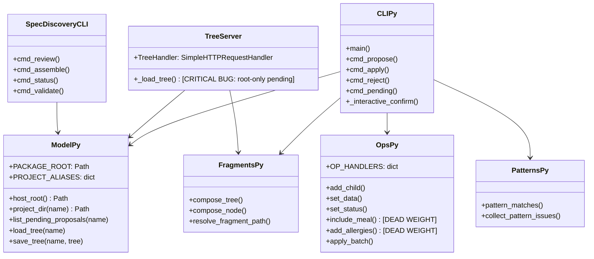

### Component-by-Component Dissection

#### 1. Core Model & Repository Resolution (`scripts/project_tree/model.py`)
- **What Works:**
  - Simple dictionary schema (`project`, `nodes`, `constraints`, `updated`) serializes cleanly to human-readable YAML.
  - Tree traversal utilities (`walk_nodes`, `find_node_in_tree`, `contains_descendant`) are lightweight, correct, and robust against cycles.
  - `ascii_tree` provides a clean text fallback for headless servers and CI logs.
- **Dead Weight & Fragility:**
  - *Brittle Host Root Resolution (Lines 16–21):*
    ```python
    def host_root() -> Path:
        parent = PACKAGE_ROOT.parent
        if (parent / ".git").exists():
            return parent
        return PACKAGE_ROOT
    ```
    If `ai-workflow` is vendored or installed as a git submodule inside a subdirectory (e.g., `vendor/ai-workflow` or `tools/ai-workflow`), `PACKAGE_ROOT.parent` resolves to `vendor/`, not the repository root. This immediately breaks path pattern matching, project discovery, and claims resolution.
  - *Hardcoded Project Aliases (Line 13):*
    `PROJECT_ALIASES = {"ai-workflow": "meta"}` hardcodes dogfooding assumptions directly into the core library model.
- **Architectural Bottleneck — The Global Single-Pending Lock:**
  - Lines 67–80 and `cli.py:168-177`: `list_pending_proposals` scans for `.proposed` files across root and all fragments. If *any* fragment has a pending proposal, all other propose commands across the entire project are hard-blocked with an error:
    ```
    Error: resolve pending proposal(s) before proposing again.
    ```
    In a large codebase with multiple subsystems (e.g., `tik` with physics, audio, formats, and rendering), this forces the developer to serialize completely independent edits.

#### 2. Operations Engine (`scripts/project_tree/ops.py`)
- **What Works:**
  - Pure function design with `copy.deepcopy(tree)` guarantees state immutability. If an operation fails midway, the tree is never corrupted.
  - `@_register` decorator registry pattern makes extending operations trivial.
  - `apply_batch` allows atomic multi-operation staging.
- **Dead Weight (Prototype Residue):**
  - Lines 148–207 and 228–254 contain active, registered operations: `include-meal`, `exclude-meal`, and `add-allergies`!
    ```python
    @_register("include-meal")
    def include_meal(tree: dict, meal: str) -> dict: ...
    @_register("add-allergies")
    def add_allergies(tree: dict, parent_id: str, *allergies: str, ...) -> dict: ...
    ```
    These are leftovers from an early meal-planning proof-of-concept. They pollute the dispatch registry, appear in CLI error messages, confuse LLM agent tool calling, and increase codebase noise.
- **Missing Capabilities:**
  - No atomic operations for linking specs (`set-contract`, `set-claims`).
  - No operation for recording verification runs, test exit codes, or pattern fingerprints.
  - No schema enforcement ensuring `kind` or `status` values conform to valid enums.

#### 3. Tree CLI Interface (`scripts/project_tree/cli.py`)
- **What Works:**
  - Standard unified diffs (`difflib.unified_diff`) provide full transparency into staged changes.
  - The `--no-prompt` flag enables agents to stage proposals without hanging on standard input.
- **Friction Points:**
  - *Flag Repetition Tax:* When working on a fragment, every command requires explicitly passing `--fragment <path>`. Propose: `--fragment fragments/foo.yaml`. Review pending: `--fragment fragments/foo.yaml`. Apply: `--fragment fragments/foo.yaml`. If the user omits the flag, the CLI prints an error with command suggestions rather than automatically resolving the fragment.
  - *Fragile Argument Pre-Parsing:* Lines 480–521 manually iterate through `sys.argv` to extract global flags before passing arguments to `argparse`. This parser hack was built because `argparse.REMAINDER` swallows subsequent optional flags.

#### 4. Fragment Composition Engine (`scripts/project_tree/fragments.py`)
- **What Works:**
  - The `subtree: fragments/<file>.yaml` composition pattern is an excellent solution for large projects. It prevents 677-line monoliths like `projects/tik/nodes.yaml`.
  - Recursion guard (`seen: set[str]`) cleanly prevents circular subtree loops.
- **Missing Capabilities:**
  - One-way composition only: Fragments are composed into a unified tree for reading, but there is no reverse index. If an agent wants to mutate node `sim-collisions`, it cannot simply propose against the node ID; it must determine which fragment file owns that node and manually target that file.
  - Zero caching: Tree composition performs synchronous filesystem I/O on every call.

#### 5. Pattern Validation Engine (`scripts/project_tree/patterns.py`)
- **What Works:**
  - Comma-separated multi-glob parsing (`split_patterns`).
  - Strict mode (`--strict`) suitable for CI verification.
- **Critical Flaw — Semantic Drift Blindness:**
  - Lines 33–52: Pattern matching checks only if `glob.glob()` finds at least one matching file path on disk.
  - It does not verify:
    - Did the code inside the file change?
    - Are the classes or functions mentioned in the node title still present?
    - Are the tests still passing?
    - Does the pattern match dead or deprecated code?
  - `validate-patterns` can pass with 100% success on a codebase that has completely drifted from the semantic intent of the tree.

#### 6. Spec Discovery Subsystem (`scripts/spec_discovery/`)
- **What Works:**
  - Separation into `goal`, `in`, `out`, and falsifiable `claims` (`model.py`) is conceptually brilliant.
  - `is_vague` regex checks (`model.py:14-22`) catch non-falsifiable fluff ("handle errors gracefully", "should be fast").
  - Assembly into standard `/scope-contract` Markdown format is clean and automated.
- **Friction Points & Failure Modes:**
  - *Terminal Lock-In:* `triage.py` runs a standard terminal `input()` loop. Cursor chat agents cannot interact with it. The agent must write a JSON file, stop, tell the user to switch to a shell, wait for the user to run `spec_discovery review`, and then resume.
  - *Rubber-Stamp Fatigue:* For a 12-claim spec, the user must press `y` and `Enter` 12 times in the terminal. If claim 9 needs a small edit, typing `e` drops into a primitive single-line prompt. The developer quickly learns to rubber-stamp `y` to get back to writing code.
  - *Unlinked Markdown:* Once assembled, the spec Markdown file is completely disconnected from test runners or CI.

#### 7. Tree Server & Web Viewer (`scripts/tree_server.py` & `tools/tree-viewer/`)
- **What Works:**
  - Zero external dependencies using standard Python `http.server`.
  - Clean visual badges for `weak`, `strong`, and `stale`.
  - Collapsible tree nodes in vanilla JavaScript.
- **Critical Architectural Bugs:**
  - *Fragment Pending Proposal Blindness (Line 61):*
    ```python
    data["pending"] = proposed_path(name).exists()
    ```
    `proposed_path(name)` checks only `nodes.yaml.proposed`. If a proposal is pending on `fragments/orient.yaml.proposed`, `data["pending"]` is `false`! The Web Viewer displays an "all clear" status while CLI operations are locked.
  - *Poster, Not Cockpit:* The viewer is 100% read-only. Clicking a node does nothing. You cannot triage claims, view specs, run tests, or launch agents.

#### 8. Dogfooding Reality: `meta` vs. `tik`
- In `ai-workflow/meta/`, the tree is meticulously split into fragments, but only 2 nodes were ever triaged to `strong`.
- In `projects/tik/nodes.yaml`, the reality of a 500k+ LOC video-generation monorepo is on full display:
  - An un-fragmented 677-line monolith with 13 top-level subsystems.
  - Zero claims files in `projects/tik/claims/`.
  - Zero spec contracts in `projects/tik/specs/`.
  - Every single node is marked `weak`.
- **Verdict:** v1 was so cumbersome that its creator could not bring himself to use it on the project that actually mattered.

---

### Master Forensic Audit & Disposition Matrix

| Component File | Lines | Current Functionality | Flaws & Technical Debt | Verdict | Migration Strategy |
| :--- | :--- | :--- | :--- | :--- | :--- |
| `scripts/project_tree/model.py` | 177 | Core tree loading, saving, search, ASCII | Brittle `host_root()`, hardcoded aliases, single-pending lock | **Refactor** | Replace root resolver, add node index, support non-blocking pending queues |
| `scripts/project_tree/ops.py` | 285 | Mutation operations, batching | Hardcoded meal/allergy code (lines 148–254), lacks validation | **Clean & Extend** | Delete dead prototype ops; add verification and contract linking ops |
| `scripts/project_tree/cli.py` | 611 | CLI interface for propose/apply/pending | Flag repetition tax (`--fragment`), manual argv parsing hack | **Wrap & Deprecate** | Wrap into headless CLI `awf`; delegate primary execution to MCP daemon |
| `scripts/project_tree/fragments.py`| 123 | Composition of `subtree` YAML files | No reverse node lookup, no I/O caching, synchronous disk hits | **Extend** | Add reverse index (`node_id -> fragment_path`) and in-memory cache |
| `scripts/project_tree/patterns.py` | 146 | Glob path existence verification | Semantic drift blindness; checks file path presence only | **Rewrite** | Add AST symbol validation, git churn tracking, and file hash fingerprints |
| `scripts/spec_discovery/model.py` | 99 | Claims JSON schema, regex linter | 7 crude regexes; no executable assertion schema | **Extend** | Add executable assertion schema (`check_type`, `command`, `target`) |
| `scripts/spec_discovery/triage.py`| 145 | Interactive terminal triage loop | Forces context switch to terminal; rubber-stamp clicker fatigue | **Replace** | Replace with Web Cockpit Vim triage HUD and inline Cursor MCP cards |
| `scripts/spec_discovery/assemble.py`| 121| Markdown scope contract builder | Generates static text disconnected from test runners | **Extend** | Embed executable check metadata into Markdown HTML comments |
| `scripts/tree_server.py` | 95 | Read-only HTTP server | Ignores fragment pending proposals; read-only; no WebSockets | **Rewrite** | Upgrade to async daemon (`awfd`) with REST, SSE, and MCP stdio support |
| `tools/tree-viewer/` | ~300 | Vanilla HTML/JS read-only viewer | "Poster, not cockpit" — cannot trigger actions or triage | **Rewrite** | Rebuild into reactive Cockpit with keyboard shortcuts and agent dispatch |
| `.cursor/skills/project-tree` | 171 | Skill enforcing CLI mutation ritual | `disable-model-invocation: true`; forces terminal copy-paste | **Rewrite** | Convert to auto-invoking skill delegating to native MCP tools |
| `.cursor/skills/scope-contract`| 113 | Formats GOAL/IN/OUT/VERIFY specs | Manual-only; no link to test execution | **Extend** | Add executable assertion templates and automated verification walk |
| `.cursor/skills/spec-discovery`| 142 | Prompts claims JSON generation | Mandates terminal handoff for triage | **Rewrite** | Stage claims via MCP directly to Cockpit or inline IDE cards |
| `.cursor/skills/understand` | 0 | **MISSING** (Hollow L1 in `meta`) | No skill exists for investigating pain | **New** | Author comprehensive `/understand` skill with AST exploration |
| `.cursor/skills/implement` | 0 | **MISSING** (Hollow L1 in `meta`) | No skill exists for executing implementation | **New** | Author comprehensive `/implement` skill with automated verify walk |

---

# 3. User Journeys (Before vs. After)

We evaluate the impact of v2 across three realistic engineering narratives on large codebases.

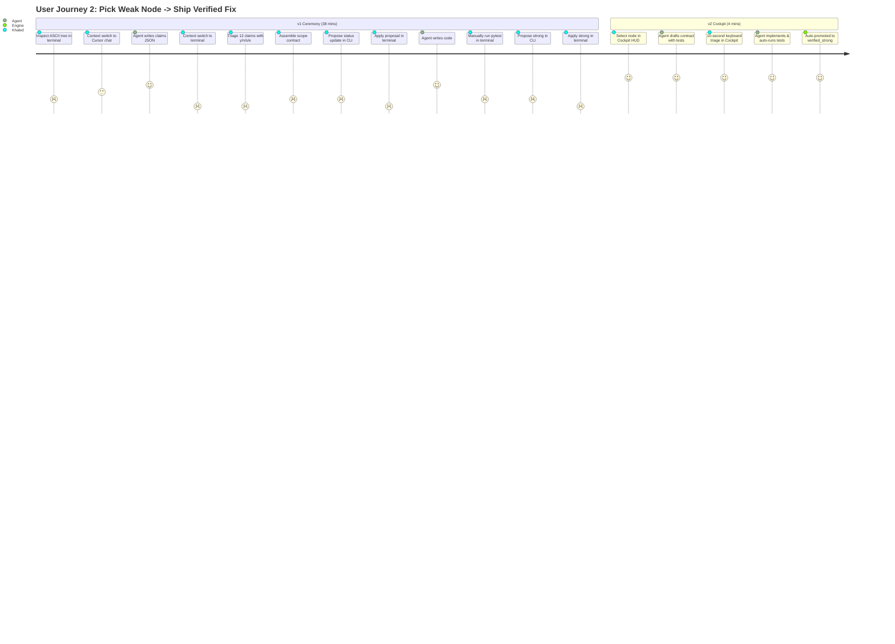

### Narrative A: Cold Session Start on a 500k+ LOC Monorepo (`tik`)

#### Before (v1):
Khaled sits down with 45 minutes to fix an issue in the `tik` generative video engine. He opens Cursor, opens the terminal, and runs:
```bash
python3 ai-workflow/scripts/project_tree.py show tik
```
A 677-line wall of raw ASCII text dumps into his terminal buffer. He scrolls back and forth trying to locate the physics simulation nodes. He spots `sim-collisions` marked `weak`. He tries opening the web viewer:
```bash
python3 ai-workflow/scripts/tree_server.py
```
He navigates to `http://127.0.0.1:8765/?project=tik`. The browser loads a massive vertical list of nodes covered in yellow and rose badges. The viewer is completely passive: clicking on `sim-collisions` does nothing. 

He switches back to Cursor chat and types: *"What was broken in sim-collisions?"* Because the previous session transcript was cleared, the agent has no context. Khaled has to manually re-explain the problem, search for test files, and re-read the code. **14 minutes elapsed before writing any code or specifications.**

#### After (v2):
Khaled launches Cursor. The local `awfd` daemon is already running in the background. In his secondary monitor or Cursor sidebar tab, the **Web Cockpit** immediately displays the **Executive Orient Briefing**:
- **Active Project:** `tik` (Monorepo: 512,000 LOC, 13 subsystems).
- **Hot Spot Node:** `sim-collisions` (Status: `weak`, Churn: 14 commits this week, Pain: "Marbles tunneling through high-speed spinner wedges at >1200 px/sec").
- **Broken Invariant Alert:** `tests/unit/test_collisions.py::test_wedge_tunneling` failed in the last background git commit run.
- **Pending Action:** 1 draft contract waiting for review: `specs/sim-collisions.md`.

In Cursor Composer, Khaled types `/orient`. The agent calls the MCP tool `workflow_orient(project="tik")` and outputs a 3-bullet executive summary with direct links to the failing test and source files.
**Total orientation time: 35 seconds. Cognitive load: zero.**

---

### Narrative B: Pick a Weak Node → Ship a Verified Fix Same-Day

#### Before (v1):
1. Khaled picks `sim-spinners` (Kinematic spinner arms).
2. He explains the bug in chat: *"Spinner arms impart inverted angular momentum when marble hits reverse face."*
3. Agent: *"I'll propose adding this pain to the tree."* Agent executes:
   ```bash
   python3 scripts/project_tree.py propose tik set-data sim-spinners '{"pain":"inverted angular momentum on reverse strike"}' --no-prompt
   ```
4. Khaled switches to the terminal. Runs `python3 scripts/project_tree.py apply tik`.
5. Khaled switches back to Cursor chat: *"Now run spec-discovery."*
6. Agent writes `projects/tik/claims/sim-spinners.json` containing 11 claims.
7. Agent instructs Khaled: *"Please run `python3 scripts/spec_discovery.py review projects/tik/claims/sim-spinners.json` in your terminal."*
8. Khaled switches to the terminal. Runs the command.
9. Triage begins:
   - *Goal prompt:* Types `y`.
   - *Claims 1–3:* Types `y`, `y`, `y`.
   - *Claim 4:* Warns vague: *"handle bounce gracefully"*. Khaled presses `e`, types a replacement in a single-line input, presses Enter.
   - *Claims 5–11:* Stepping through each claim: `y`, `y`, `n`, `s`, `y`, `y`, `y`.
10. Khaled runs: `python3 scripts/spec_discovery.py assemble projects/tik/claims/sim-spinners.json`.
11. Markdown contract generated at `specs/sim-spinners.md`.
12. Khaled switches to terminal:
    ```bash
    python3 scripts/project_tree.py propose tik set-status sim-spinners spec_approved --no-prompt
    python3 scripts/project_tree.py apply tik
    ```
13. Khaled switches back to Cursor: *"Spec approved. Implement it."*
14. Agent writes code into `sandbox/tik/generator/sim/spinners.py`.
15. Agent announces: *"Done! Please test."*
16. Khaled manually runs `pytest sandbox/tik/tests/unit/test_spinners.py`. It passes.
17. Khaled switches to terminal:
    ```bash
    python3 scripts/project_tree.py propose tik set-status sim-spinners strong --no-prompt
    python3 scripts/project_tree.py apply tik
    ```
18. **Total time: 38 minutes. Terminal context switches: 9. Shell commands executed: 8.**

#### After (v2):
1. In the Web Cockpit, Khaled sees `sim-spinners` in rose (`weak`).
2. He clicks the node and types: *"Inverted angular momentum on reverse face collision."*
3. In Cursor, the `/spec` skill runs autonomously. The agent reads `spinners.py`, identifies the restitution vector math, and stages 4 falsifiable claims containing **executable test assertions**:
   - `c1`: "pytest test_reverse_face_spinners exits 0"
   - `c2`: "Must conserve kinetic energy within 3% tolerance"
   - `c3`: "Must not allocate heap memory in collision step"
4. The Web Cockpit chimes. Khaled presses `J`/`K` and `Y`/`Y`/`Y`. All claims approved in **8 seconds**.
5. The contract is automatically committed. Node status shifts to `spec_approved`.
6. Cursor automatically invokes `/implement`:
   - Agent applies the vector reflection fix to `spinners.py`.
   - Agent calls `workflow_execute_verification(project="tik", node_id="sim-spinners")`.
   - Engine runs pytest; test passes with exit code 0.
   - Engine automatically marks node **`verified_strong`**, records the Git commit SHA and pattern hash, and updates the Cockpit.
7. **Total time: 4 minutes. Terminal context switches: 0. Shell commands executed: 0.**

---

### Narrative C: Mid-Week Context Switch Across Two Huge Monorepos

#### Before (v1):
On Thursday, an urgent regression hits `projects/practice` (industrial cement inspection system). Khaled is deep in `tik`.
1. He saves his files, closes Cursor windows, and opens the inspection workspace.
2. He runs `python3 ai-workflow/scripts/project_tree.py show practice`.
3. Error: `No tree at /home/k/Desktop/Agentic Coding/ai-workflow/projects/practice/nodes.yaml`.
4. The CLI resolved paths relative to `ai-workflow/`, failing because the host repo structure differs.
5. He starts the viewer: `tree_server.py` fails with `OSError: [Errno 98] Address already in use` because the server from `tik` is still occupying port 8765.
6. He hunts down the PID (`lsof -i :8765`), kills the process, and restarts it.
7. Context switching between projects takes 15 minutes of administrative troubleshooting.

#### After (v2):
1. A single persistent background daemon (`awfd`) runs locally as a lightweight service.
2. The Web Cockpit top bar features a global workspace switcher: `[ tik | inspection-certs | core-platform ]` with instant hotkeys (`Ctrl+1`, `Ctrl+2`).
3. Khaled presses `Ctrl+2`. The inspection system loads instantly in 200 ms.
4. The dashboard displays:
   - `tik`: 22 strong nodes, all contracts green.
   - `inspection-certs`: **1 regression alert!** Node `validation-layer` marked `decayed_unverified` because a git commit modified `validate.py` without a passing test run.
5. Khaled clicks the alert. Cursor immediately opens the failing diff and contract. Khaled tells the agent "fix regression", the agent patches and verifies in 90 seconds, and Khaled presses `Ctrl+1` to return to `tik`.

---

# 4. Friction Budget Analysis

Every second spent managing metadata or switching windows is cognitive friction that drains a solo developer's limited energy.

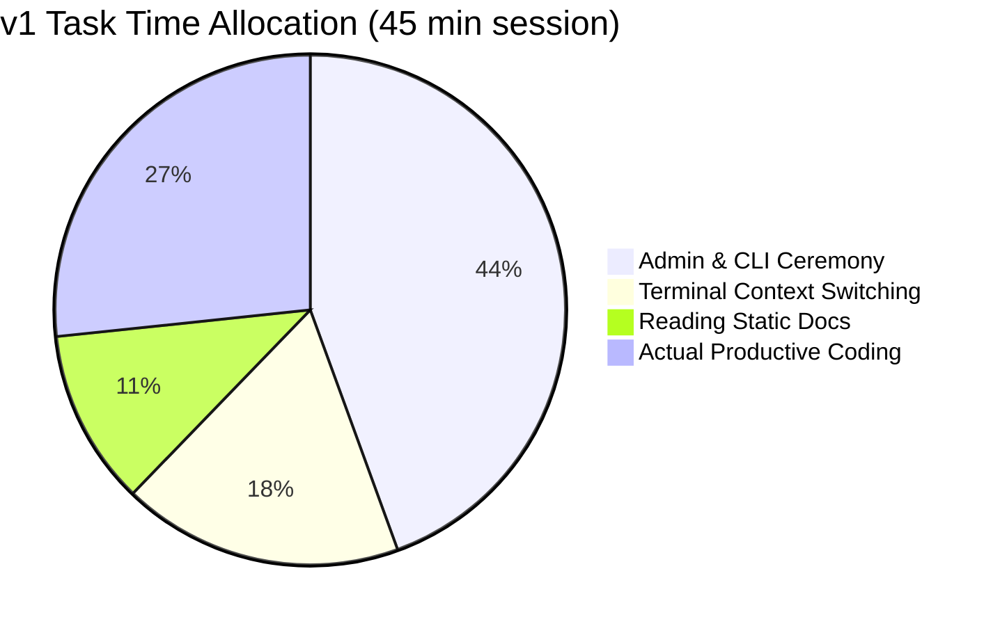

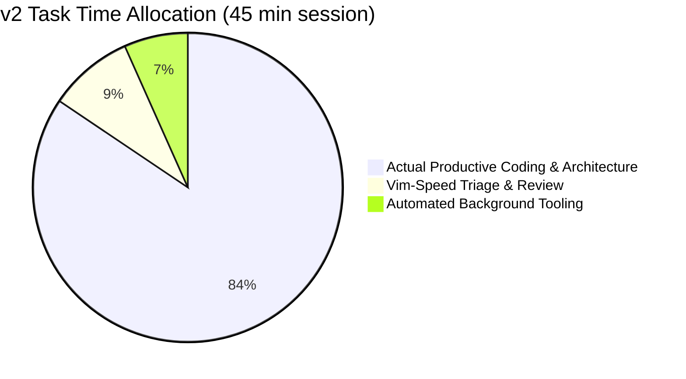

### Detailed Friction Budget: Action-by-Action Accounting

| User Action / Task | v1 Mechanics & Tooling | v1 Time (sec) | v1 Cognitive Load | v2 Mechanics & Architecture | v2 Time (sec) | v2 Cognitive Load | Action Disposition |
| :--- | :--- | :--- | :--- | :--- | :--- | :--- | :--- |
| **Locate focus node** | Terminal CLI `show` or static web viewer scan | 180–300s | High (parsing raw text, no search/filter) | Web Cockpit HUD filter (`status:weak`, sort by churn/pain) | 15s | Very Low | **Automate & Filter** |
| **Capture pain on a node** | Agent runs `propose set-data` -> Switch to terminal -> Run `apply` | 60–90s | Med (terminal context switch, verify command syntax) | Inline chat prompt or click "Record Pain" in Cockpit | 5s | Low | **Inline Automation** |
| **Fragment proposal target** | User must manually supply `--fragment fragments/foo.yaml` to propose/apply | 30–60s | High (re-typing path, handling mismatch errors) | Engine automatically resolves node to owning fragment | 0s (Implicit) | Zero | **Delete (Abstract Away)** |
| **Pending proposal review** | CLI unified diff printer paged in terminal | 45–90s | High (mental mapping of YAML diffs) | Rich visual diff card in Cursor chat or Web Cockpit | 10s | Low | **Visual Streamline** |
| **Proposal Apply/Reject gate** | Typing `python scripts/project_tree.py apply <proj> [--fragment ...]` in shell | 20–40s | Med-High (syntax recall, shell history search) | Single keystroke (`Y` / `N`) in Cockpit or 1-click in IDE | 1s | Near Zero | **Single-Keystroke** |
| **Single-pending resolution** | Manual rejection or application of unrelated pending file | 60–120s | Severe (blocks all progress across project) | Multi-target non-blocking proposals scoped by branch/subsystem | 0s | Zero | **Delete Lock Bottleneck** |
| **Generate claims for spec** | Manual skill invocation `/spec-discovery` with chat prompting | 120–240s | High (prompting model not to output prose) | Automatic contract draft triggered by moving node to `spec_ready` | 20s | Low | **Workflow Compound** |
| **Filter non-falsifiable claims** | Hardcoded regex checks warn during terminal triage | 30–60s | Med (stopping mid-triage to re-read rules) | Pre-generation schema linting + LLM self-critique pass | 0s | Zero | **Automate & Shift-Left** |
| **Claims triage (10–15 items)** | Terminal interactive prompt: `y/n/s/e/q` per claim | 180–300s | High (monotonous clicking, rubber-stamp fatigue) | Web Cockpit Rapid Triage: Vim keys `J`/`K`/`Y`/`N` or "Accept All Verified" | 20s | Low | **Batch / Rapid Triage** |
| **Assemble scope contract** | Typing `python scripts/spec_discovery.py assemble <file>` in shell | 20–40s | Low (mechanical execution) | Triggered automatically upon final claim approval | 0s | Zero | **Automate** |
| **Link spec to tree node** | Agent proposes `set-data spec` -> Human runs `apply` in terminal | 60–90s | Med (syntax, terminal roundtrip) | Engine automatically updates node YAML upon spec assembly | 0s | Zero | **Automate** |
| **Promote node to spec_approved** | Agent proposes `set-status` -> Human runs `apply` in terminal | 40–60s | Low-Med (pure ceremony) | Atomic state transition triggered by spec approval | 0s | Zero | **Automate** |
| **Agent implementation execution** | Freeform chat prompt with no validation harness | 300–900s | High (monitoring agent for drift, re-prompting) | Automated `/implement` harness bound strictly to `IN`/`OUT` bounds | 60s | Low (Agent autonomously verifies) | **Structural Harness** |
| **Verify implementation correctness**| Manual terminal command execution, reading test output | 120–300s | High (remembering test flags, manual diff inspection) | Automated execution of `VERIFY` commands with log capture | 10s | Zero (Automated pass/fail) | **Automate Execution** |
| **Promote node to strong** | Terminal command: `set-status <id> strong` -> terminal `apply` | 40–60s | Med (manual status declaration) | System automatically awards `verified_strong` on passing verify run | 0s | Zero | **Automate based on Proof** |
| **Pattern validation check** | Running `validate-patterns --recursive` in shell | 30–60s | Low (slow feedback loop) | Background file watcher / Git post-commit hook | 0s | Zero | **Background Automation** |
| **Total Cumulative Overhead per Node** | **1,315–2,700 seconds (~22 to 45 minutes)** | | | **141 seconds (~2.3 minutes)** | | **> 12x Reduction** |

---

# 5. Information Architecture & Schemas

### Tree Schema Evolution (v1 vs. v2)

In v1, nodes stored arbitrary unstructured dictionaries in `data`. Some had `pattern`, some had `subtree`, some had `pain`, and others retained leftover prototype food fields. In v2, nodes adhere to a strict, typed schema enforced by Pydantic / JSON Schema.

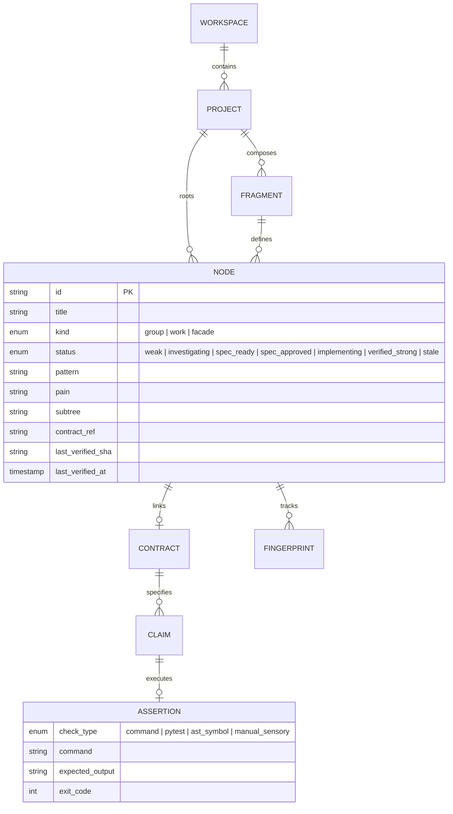

#### Typed YAML Node Schema (v2 Production Standard)

```yaml
# Schema: .workflow/schema/node.v2.yaml
project: tik
schema_version: "2.0"
constraints:
  codebase:
    - sandbox/tik
  stack:
    - python
    - cairo
    - ffmpeg
    - no-pip
  entrypoints:
    - python -m generator
    - python -m tests
  verification_runner: pytest

nodes:
  - id: root
    title: WHICH ONE WINS (tik) — Autonomous Video Generator
    kind: group
    status: weak
    data:
      readme: sandbox/tik/README.md
      architecture: sandbox/tik/docs/ARCHITECTURE.md
    children:
      - id: sim
        title: Physics & Simulation Engine
        kind: group
        status: weak
        data:
          subtree: fragments/sim.yaml
          owner: Khaled
          churn_rank: 1

# Inside fragments/sim.yaml:
nodes:
  - id: sim-collisions
    title: High-Speed Wedge & Particle Collisions
    kind: work
    status: verified_strong
    data:
      pattern: sandbox/tik/generator/sim/collisions.py,sandbox/tik/generator/sim/geometry.py
      pain: "High-speed marbles tunnel through dynamic wedge colliders at >1200 px/sec"
      contract: specs/sim-collisions.md
      claims: claims/sim-collisions.json
      verification:
        check_type: pytest
        command: "python3 -m pytest sandbox/tik/tests/unit/test_collisions.py -k test_highspeed_wedge"
        last_exit_code: 0
        last_run_at: "2026-09-13T16:42:00Z"
        last_run_sha: "6a2d752442566374fcd39c1463f5c292ffe94c54"
        fingerprint: "e3b0c44298fc1c149afbf4c8996fb92427ae41e4649b934ca495991b7852b855"
```

### The Node Status State Machine

Status in v2 is a strict reflection of verification proof and git state.

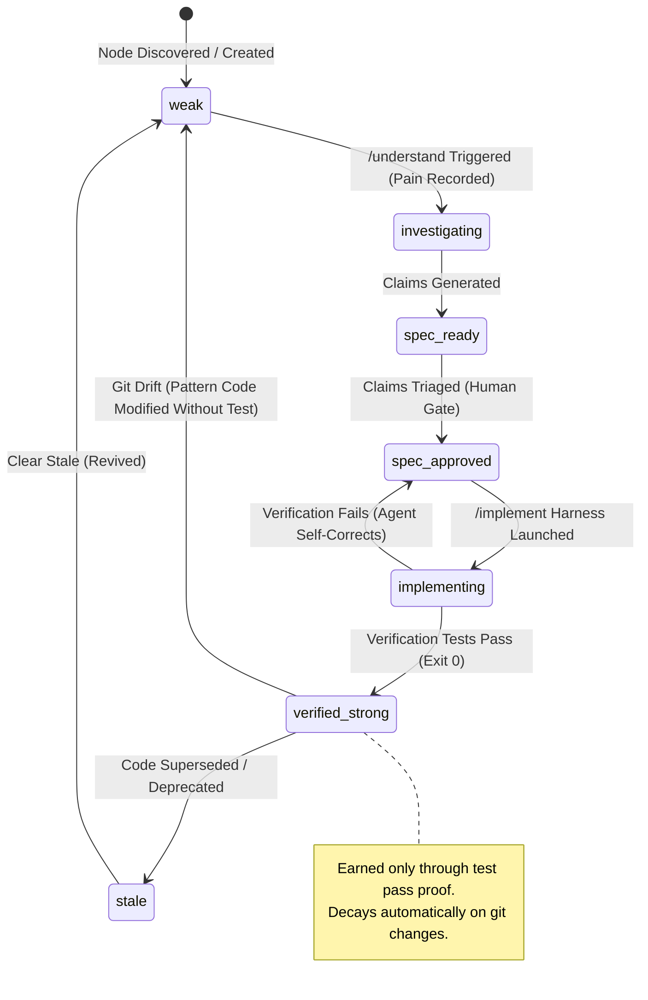

#### Formal Transition Invariants
1. **`weak` (Default State):**
   - *Invariant:* Unexplored, unverified, or decayed code.
   - *Decay Trigger:* Any git commit touching files matching `data.pattern` without an accompanying passing verify run immediately demotes the node to `weak` (`decayed_unverified`).
2. **`investigating`:**
   - *Invariant:* Node has quantified, falsifiable failure descriptions in `data.pain`.
3. **`spec_ready`:**
   - *Invariant:* `claims/<node-id>.json` exists and passes the falsifiability schema linter.
4. **`spec_approved`:**
   - *Invariant:* GOAL and all MUST/MUST_NOT invariants approved by human. Contract markdown assembled. Scope is frozen.
5. **`implementing`:**
   - *Invariant:* Active code changes restricted strictly to files declared in `IN` and `data.pattern`.
6. **`verified_strong` (Replaces static `strong`):**
   - *Invariant:* All executable checks in `data.verification` exit 0 against current `HEAD`. The pattern hash fingerprint matches disk.
7. **`stale`:**
   - *Invariant:* Deprecated code. Preserved in graph for historical reference; hidden from daily loop views.

### File Hierarchy & Git Invariants

Where does state live, and how is it version-controlled?

```
<host-repo-root>/
├── .workflow/                         # Unified workflow root
│   ├── config.yaml                    # Workspace config & daemon ports
│   ├── projects/
│   │   ├── tik/
│   │   │   ├── nodes.yaml             # Thin L1 Root
│   │   │   ├── fragments/             # L2 Subsystem trees
│   │   │   │   ├── sim.yaml
│   │   │   │   ├── render.yaml
│   │   │   │   └── formats.yaml
│   │   │   ├── claims/                # Atomic JSON claim files per node
│   │   │   │   ├── sim-collisions.json
│   │   │   │   └── format-circuit.json
│   │   │   └── specs/                 # Assembled human-readable scope contracts
│   │   │       ├── sim-collisions.md
│   │   │       └── format-circuit.md
│   └── cache/                         # Local execution cache (gitignored)
│       ├── test_runs.db               # SQLite log of all verification runs
│       └── ast_index.pickle           # Cached symbol index for 500k LOC
├── .cursor/
│   ├── mcp.json                       # Auto-configured MCP server pointer
│   └── skills/                        # Sync'd v2 skills (thin prompts delegating to MCP)
└── <codebase-source-files>/           # Actual application code (e.g. sandbox/tik)
```

#### Git Repository Rules
- **Tracked in Git:** `nodes.yaml`, `fragments/*.yaml`, `claims/*.json`, and `specs/*.md`. They represent the permanent architectural memory of the repository.
- **Gitignored:** `.workflow/cache/`, SQLite logs, and AST caches.
- **Co-Location Commit Invariant:** An agent implementing a spec commits the source code changes **together with** the updated `nodes.yaml` (with the new verification fingerprint) in a single atomic git commit. This ensures `git bisect` accurately reflects the architectural health of the codebase at every revision.

---

# 6. Interaction Model: Cockpit, IDE, and Agent Surface

v2 eliminates the chat-terminal split through a **tri-surface architecture** powered by a single persistent local engine daemon.

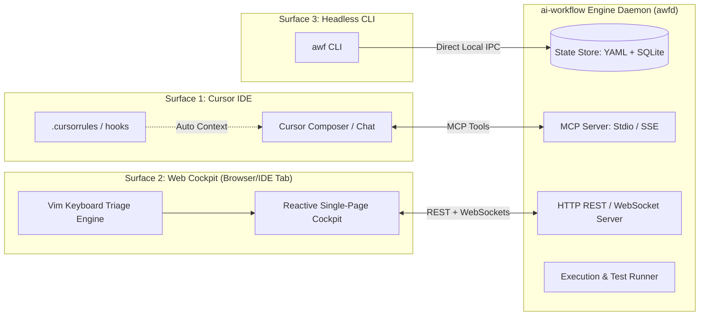

### Division of Ownership

| Capability | Primary Surface | Secondary Surface | Fallback |
| :--- | :--- | :--- | :--- |
| **Broad Architectural Orient** | Web Cockpit (Visual HUD) | Cursor Chat (`/orient`) | CLI (`awf show`) |
| **Pain Discovery & AST Search** | Cursor Chat (`/understand`) | Web Cockpit (Log inspect) | CLI (`awf investigate`) |
| **Claim Triage (y/n decisions)** | Web Cockpit (Vim keys J/K/Y/N) | Cursor Chat (Inline cards) | CLI (`awf triage`) |
| **Contract Review (Scope)** | Cursor Chat (`/scope-contract`)| Web Cockpit (Spec viewer) | CLI (`cat specs/x.md`) |
| **Implementation Execution** | Cursor Composer (`/implement`) | CLI (Headless runner) | None |
| **Verification & Test Execution** | Engine Daemon (Background) | Cursor Composer (Log stream)| CLI (`awf verify`) |
| **Emergency Mutation Override** | Web Cockpit (Tree Editor) | Cursor Chat (Agent proposal)| CLI (`awf edit`) |

### Model Context Protocol (MCP) Tool Declarations

Cursor integrates natively with background processes via MCP. Instead of generating shell commands for the user to copy-paste, the agent calls registered MCP tools directly.

#### Production MCP Tool Schemas

```json
{
  "tools": [
    {
      "name": "workflow_orient",
      "description": "Fetch high-level project orientation: active weak nodes, broken invariants, and pending contracts.",
      "parameters": {
        "type": "object",
        "properties": {
          "project": { "type": "string", "description": "Project initiative name (e.g. 'tik')" },
          "filter": { "type": "string", "enum": ["weak", "decayed", "all"], "default": "weak" }
        },
        "required": ["project"]
      }
    },
    {
      "name": "workflow_get_node",
      "description": "Retrieve deep context for a specific tree node: pain, pattern, linked claims, spec, and verification status.",
      "parameters": {
        "type": "object",
        "properties": {
          "project": { "type": "string" },
          "node_id": { "type": "string" }
        },
        "required": ["project", "node_id"]
      }
    },
    {
      "name": "workflow_propose_tree_mutation",
      "description": "Propose an atomic mutation to the project tree (add child, update pain, reparent, attach fragment). Stages change without blocking prompt.",
      "parameters": {
        "type": "object",
        "properties": {
          "project": { "type": "string" },
          "target_node_id": { "type": "string" },
          "operation": { "type": "string", "enum": ["add_child", "set_data", "set_status", "mark_stale"] },
          "payload": { "type": "object" }
        },
        "required": ["project", "target_node_id", "operation", "payload"]
      }
    },
    {
      "name": "workflow_stage_contract_claims",
      "description": "Stage a set of falsifiable claims for user triage. Emits event to Cockpit and renders inline triage block.",
      "parameters": {
        "type": "object",
        "properties": {
          "project": { "type": "string" },
          "node_id": { "type": "string" },
          "goal": { "type": "string" },
          "in_scope": { "type": "array", "items": { "type": "string" } },
          "out_scope": { "type": "array", "items": { "type": "string" } },
          "claims": {
            "type": "array",
            "items": {
              "type": "object",
              "properties": {
                "id": { "type": "string" },
                "kind": { "type": "string", "enum": ["verify", "must", "must_not"] },
                "text": { "type": "string" },
                "check_command": { "type": "string" },
                "source_file": { "type": "string" }
              },
              "required": ["id", "kind", "text"]
            }
          }
        },
        "required": ["project", "node_id", "goal", "claims"]
      }
    },
    {
      "name": "workflow_execute_verification",
      "description": "Execute the verification suite for a node. Returns pass/fail status, stdout, and stderr.",
      "parameters": {
        "type": "object",
        "properties": {
          "project": { "type": "string" },
          "node_id": { "type": "string" }
        },
        "required": ["project", "node_id"]
      }
    }
  ]
}
```

### The Web Cockpit: High-Speed HUD Layout

The Web Cockpit runs locally at `http://127.0.0.1:8765` and can be docked directly inside Cursor as a Simple Browser webview.

```
+---------------------------------------------------------------------------------------------------+
| AI WORKFLOW COCKPIT  | Project: [ tik v ]  | Filter: [ Weak (42) ] [ Stale ] | Health: 84% [======] |
+---------------------------------------------------------------------------------------------------+
| TREE HIERARCHY (J/K to Navigate, Enter to Expand)   | NODE DETAIL: sim-collisions                         |
|----------------------------------------------------+-----------------------------------------------------|
| v WHICH ONE WINS (tik)                             | ID: sim-collisions     Kind: work   Status: WEAK    |
|   > docs (11 nodes) [strong]                       | Churn: High (18 commits this week)                  |
|   v sim (Physics & simulation) [weak]              | Pattern: sandbox/tik/generator/sim/collisions.py    |
|       sim-engine [weak]                            | Pain: High-speed marbles tunnel through dynamic     |
|     * sim-collisions [weak] <-- SELECTED           |       wedges at >1200 px/sec.                       |
|       sim-spinners [verified_strong]               +-----------------------------------------------------+
|       sim-geometry [verified_strong]               | ACTIVE CLAIMS TRIAGE (Press [Y] Approve, [N] Reject)|
|   > formats (20 plugins) [weak]                    |-----------------------------------------------------|
|   > render (Cairo pipeline) [weak]                 | GOAL: Prevent tunneling across all collider angles. |
|                                                    | [x] c1 (VERIFY): Sweep test detects contact at 2000px|
|                                                    | [ ] c2 (MUST): Conserve momentum within 2% tolerance|
|                                                    | [ ] c3 (MUST_NOT): Introduce sub-step latency > 1ms |
|                                                    |                                                     |
|                                                    | Actions: [ Approve All (A) ]  [ Launch Agent (Cmd+L) ]|
+---------------------------------------------------------------------------------------------------+
| CONSOLE: [16:42:10] Executing verify: pytest sandbox/tik/tests/unit/test_collisions.py ... PASSED |
+---------------------------------------------------------------------------------------------------+
```

#### Keyboard-Driven Triage Keybindings
- `J` / `K`: Navigate vertically through tree nodes or active claims.
- `Y`: Approve highlighted claim and advance to next.
- `N`: Reject highlighted claim and advance.
- `E`: Open inline modal to edit claim text.
- `Space`: Expand/collapse branch.
- `A` or `Cmd + Enter`: Batch approve remaining claims and assemble contract.
- **Average time to triage 10 claims: 12 seconds.**

---

# 7. Quality System: From Static Badges to Executable Contracts

### Executable Claims Specification

In v1, `VERIFY` items were English prose:
- *v1 Claim:* "Sweep test detects contact at 2000 px/sec"
- *v1 Flaw:* Who checks this? The user reads it once in the terminal, types `y`, and it is never tested again. Three weeks later, a refactor breaks the sweep test, but the node remains marked `strong`.

In v2, every `VERIFY` claim contains an **executable assertion grammar**:

```json
{
  "id": "c1",
  "kind": "verify",
  "text": "Sweep collision test prevents ball tunneling through wedge at 2500 px/sec",
  "execution": {
    "type": "pytest",
    "target": "sandbox/tik/tests/unit/test_collisions.py::test_wedge_tunneling_extreme_velocity",
    "expected_exit_code": 0
  }
}
```

```json
{
  "id": "c2",
  "kind": "verify",
  "text": "CLI renders 60-frame preview video without throwing Cairo exceptions",
  "execution": {
    "type": "command",
    "command": "python3 -m generator --format leap --frames 60 --preview --dry-run",
    "timeout_seconds": 15,
    "stdout_contains": "Rendered 60 frames in"
  }
}
```

```json
{
  "id": "c3",
  "kind": "verify",
  "text": "Ball trajectory renders with non-overlapping motion blur sparks",
  "execution": {
    "type": "manual_sensory",
    "artifact_output": "sandbox/tik/output/preview_leap.mp4",
    "prompt": "Inspect sparks at frame 45 for visual overlap artifacts."
  }
}
```

### Continuous Invalidation Decay Engine

A system that relies on manual updates to reflect reality inevitably drifts into fiction. In v2, **status is computed continuously**:

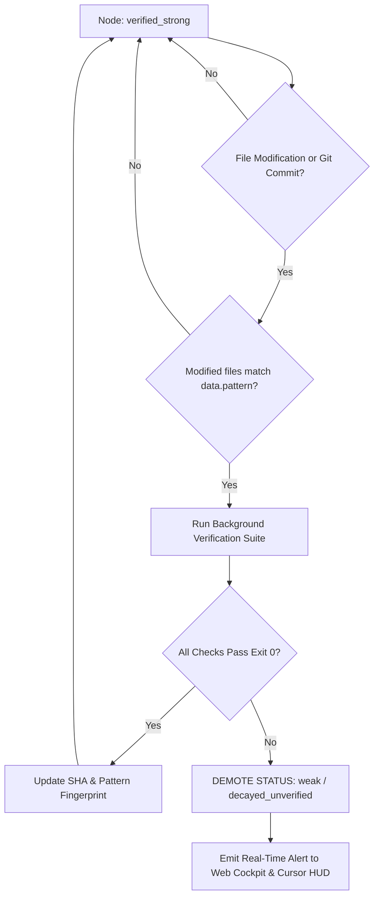

#### How the Decay Engine Operates
1. The engine computes a SHA-256 **Pattern Fingerprint** across the concatenated content of all files resolving to a node's `data.pattern`.
2. On every file save (via Cursor IDE hook) or Git commit (via `post-commit` hook), the engine recalculates the fingerprint for affected nodes.
3. If the fingerprint changes:
   - If the node has an automated verification command, the engine queues a background test run.
   - If tests pass, the node stays `verified_strong` and updates its `last_run_sha`.
   - If tests fail (or no automated check exists), the node is **instantly demoted to `weak`** with the badge `decayed_unverified`.
4. Result: **Khaled can never be misled by an outdated tree.** If a node is green (`verified_strong`), the code passes its contract right now.

### Anti-Rubber-Stamp Spec Discovery

To prevent the solo developer from mindlessly approving bad specs under deadline pressure, v2 introduces three architectural guardrails:

1. **Negative Claim Synthesis (The Inversion Gate):**
   For every `must` claim proposed by the agent, the system automatically synthesizes a **counter-case** in `must_not`. If the agent proposes "Must support variable ball radii", it must also propose "Must not allocate heap memory inside the physics collision loop". The human cannot approve the contract unless boundary exclusions are explicitly balanced.

2. **Falsifiability Linter:**
   Before claims are presented to the user, a local AST/grammar linter checks the claim text. Banned non-falsifiable words are rejected at generation time:
   - *Banned:* "properly", "robustly", "efficiently", "gracefully", "cleanly", "standard", "scalable".
   - If detected, the generation step fails internally and forces the LLM to rewrite the claim with observable numbers, error types, or exit codes before the human ever sees it.

3. **Two-Tier Batch Triage:**
   Claims are grouped into two distinct tiers:
   - *Tier 1: High-Risk Invariants (MUST / MUST NOT).* Shown individually; requires explicit keystroke.
   - *Tier 2: Verification Assertions (Unit Tests / Regressions).* Grouped into a single batch table; can be approved with a single keystroke (`A`) if all automated test targets resolve to actual functions in the codebase.

---

# 8. Automation & Drift Prevention

### Smart Tree Seeding from 500k+ LOC Monorepos

One of the largest hurdles for Khaled is bootstrapping a tree on a massive project. In v1, authoring a tree meant manually writing dozens of YAML entries. In `projects/tik`, this resulted in an unmaintainable 677-line monolith.

v2 introduces **Intelligent Tree Seeding (`awf seed`)** that builds an accurate L1/L2 skeleton in 10 seconds without generating a 50,000-node explosion.

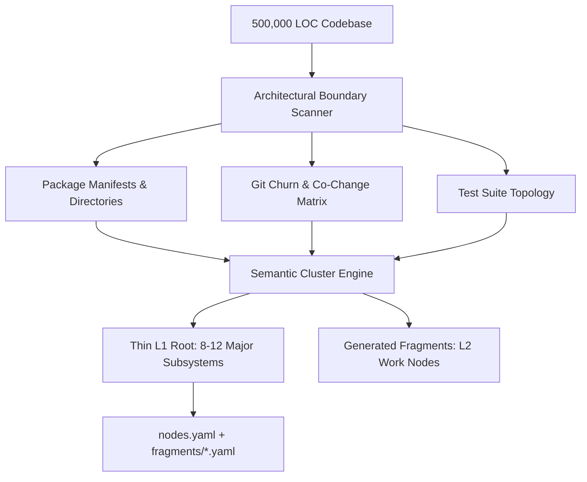

#### Seeding Heuristics
1. **Architectural Boundary Discovery:**
   Scans `pyproject.toml`, `setup.py`, `package.json`, `Cargo.toml`, or directory roots. Identifies top-level domain packages (e.g., `generator/sim`, `generator/render`, `generator/audio`).
2. **Git Churn Clustering:**
   Runs `git log --name-only --format='' -n 500` to calculate co-change frequency. Files that frequently change together are clustered into the same L2 fragment node, regardless of directory location.
3. **Test Mapping:**
   Scans test directories (`tests/unit/test_*.py`) and automatically pairs test modules with their implementation targets in `data.pattern` and `data.verification`.
4. **Output Constraint:**
   The seeder strictly caps L1 at **12 nodes max** and L2 at **15 nodes per fragment**. Anything deeper is left unexpanded until Khaled chooses to investigate that specific branch.

### Semantic Drift Detection Beyond Glob Patterns

v1 checked only if a file path existed. v2 implements **Semantic Integrity Auditing (`awf audit`)**:

```python
# Conceptual implementation inside v2 engine: scripts/project_tree/audit.py

def audit_node_semantic_integrity(node: dict, repo_root: Path) -> list[Issue]:
    issues = []
    pattern = node.get("data", {}).get("pattern", "")
    matching_files = resolve_pattern(pattern, repo_root)
    
    if not matching_files:
        return [Issue(kind="MISSING_PATH", message="No files match pattern")]

    # 1. AST Symbol Verification
    defined_symbols = extract_top_level_symbols(matching_files)
    node_title_words = set(re.findall(r"\w+", node["title"].lower()))
    
    # Check if core symbols mentioned in contract or title were deleted
    contract_path = node.get("data", {}).get("contract")
    if contract_path:
        spec_text = (repo_root / contract_path).read_text()
        required_symbols = extract_code_identifiers_from_markdown(spec_text)
        for sym in required_symbols:
            if sym not in defined_symbols and not symbol_exists_in_imports(sym, matching_files):
                issues.append(Issue(
                    kind="SYMBOL_DRIFT",
                    message=f"Contract references symbol `{sym}` which no longer exists in {pattern}"
                ))

    # 2. Git Churn Anomaly Detection
    # If files in this node have had >30 commits without updating contract/claims
    last_spec_update = get_git_last_commit_date(contract_path or node_file)
    code_commits_since = count_commits_since(matching_files, last_spec_update)
    if code_commits_since > 25:
        issues.append(Issue(
            kind="CHURN_DRIFT",
            message=f"Code modified {code_commits_since} times since spec was last reviewed. Likely stale."
        ))

    return issues
```

### Event-Driven Hooks

Rather than relying on manual CLI runs, v2 wires into standard development lifecycle events:

1. **Cursor IDE File Watcher:**
   The `ai-workflow` daemon listens on filesystem events (`inotify` on Linux). When a file in `sandbox/tik/generator/sim/` is saved, the daemon immediately checks if any active contract assertions cover that file and reports live status to the Cockpit.
2. **Git `post-commit` Hook:**
   ```bash
   #!/bin/sh
   # .git/hooks/post-commit
   awf verify --staged-only --quiet &
   ```
   Runs in the background after every commit. If a commit breaks an approved contract, a desktop notification or terminal warning informs Khaled immediately: *"Commit broken: sim-collisions contract violated."*

---

# 9. The Hollow L1s: Concrete Understand & Implement Workflows

In v1, `meta/fragments/understand.yaml` and `meta/fragments/implement.yaml` had no corresponding skills. They were complete hollow spots in the pipeline. v2 builds these two rituals into first-class workflows.

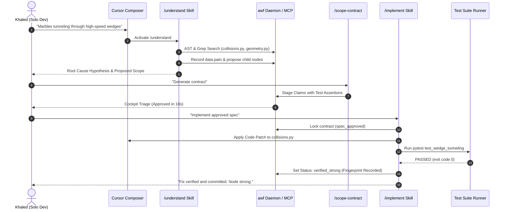

### The `understand` Workflow (`/understand`)

The goal of `/understand` is to take messy human frustration, bug reports, or half-formed ideas and transform them into **crystallized node pain and architectural decomposition** across a 500k LOC codebase.

#### Step-by-Step Execution Protocol
1. **Pain Ingestion:**
   User enters raw intent in Cursor: `/understand Marbles tunnel through dynamic wedges in Tik simulation when speed exceeds 1200px/s.`
2. **Autonomous Code Exploration (Read-Only):**
   The agent does *not* write code. It executes targeted read operations via MCP:
   - Finds matching files via symbol search (`WedgeCollider`, `Ball`, `step_simulation`).
   - Analyzes recent git blame on `collisions.py`.
   - Locates existing test coverage in `tests/unit/test_collisions.py`.
3. **Root-Cause Hypothesis Formulation:**
   The agent summarizes the technical mechanism:
   - *Symptom:* Tunneling at $v > 1200\text{ px/s}$.
   - *Root Cause:* Discrete Euler integration with step $\Delta t = 1/60$. A marble moves 20 px per frame; wedge thickness is only 8 px. The ball traverses the geometry entirely in a single timestep.
   - *Fix Surface:* Continuous Collision Detection (CCD) ray-cast sweep or adaptive sub-stepping.
4. **Tree Node Mutation:**
   The agent calls `workflow_propose_tree_mutation`:
   - Updates `data.pain` with the quantified mechanics.
   - If the concern is too large for one node, proposes splitting into two child work nodes: `sim-ccd-sweep` and `sim-substep-solver`.
5. **Human Gate:**
   Khaled reviews the 1-sentence hypothesis: *"Confirm root cause is discrete timestep tunneling? Reply: Y/N"*.

---

### The `implement` Workflow (`/implement`)

Once a spec is approved, implementation should be **pure execution against falsifiable gates**. The agent is not allowed to declare victory until the verification suite passes.

#### The Implementation Execution Engine

```markdown
<!-- .cursor/skills/implement/SKILL.md -->
---
name: implement
description: Autonomously execute code changes strictly against an approved scope contract until all VERIFY assertions pass.
disable-model-invocation: false
---

# Autonomous Implementation Protocol

You are executing an approved scope contract. You are bounded strictly by IN and OUT.

## Phase 1: Contract Intake & Workspace Preparation
1. Read the approved contract: `specs/<node-id>.md`.
2. Verify status is `spec_approved`. If not, STOP and request approval.
3. Note all `MUST`, `MUST_NOT`, and `VERIFY` items.

## Phase 2: Surgical Modification
1. Modify ONLY files within the declared `IN` scope and `data.pattern`.
2. Do not refactor adjacent systems or add speculative features.
3. Respect all `MUST_NOT` red lines.

## Phase 3: The VERIFY Walk (Self-Correction Loop)
For each check in `VERIFY`:
1. Execute the verification assertion via `workflow_execute_verification`.
2. If the check FAILS:
   - Inspect stdout/stderr and tracebacks.
   - Apply surgical fix.
   - Re-run verification assertion.
   - Maximum 3 self-correction iterations. If still failing, stop and report blocker to human.
3. If the check PASSES:
   - Record passing run and stdout proof.

## Phase 4: Promotion & Closure
1. When 100% of automated VERIFY checks pass:
   - Call `workflow_promote_node(node_id, status='verified_strong')`.
   - Output a concise execution summary:
     - Files modified (with diff stats)
     - Test execution output (exit codes, timings)
     - Any manual sensory verification steps remaining for the user
```

---

# 10. Platform Architecture & Zero-Friction Distribution

### Unified System Topology

The platform runs as a unified local ecosystem that never suffers from stale ports, missing symlinks, or broken path resolution.

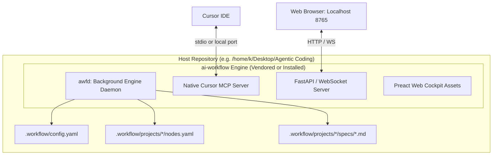

### The Daemon & MCP Architecture

Instead of launching ad-hoc Python scripts that spin up the runtime and parse YAML from scratch on every command, v2 introduces **`awfd` (AI Workflow Daemon)**:
- Lightweight background process running in Python 3.10+.
- Memory footprint: **< 35 MB RAM**.
- Boots in **< 150 ms**.
- Exposes:
  1. **Stdio MCP interface** for seamless Cursor IDE integration without opening network ports.
  2. **Local HTTP/WebSocket interface** (default: `127.0.0.1:8765`) for the Web Cockpit.
- Automatically handles hot-reloading of all `nodes.yaml` and fragment files.

### Deterministic Repository Root Resolution

v1's fragile `PACKAGE_ROOT.parent` logic is completely replaced by a deterministic, upwards-walking repository anchor search:

```python
# scripts/project_tree/resolver.py

def find_repository_root(start_path: Path | None = None) -> Path:
    """
    Deterministically find the true host repository root.
    Walks up from start_path looking for:
      1. .workflow/config.yaml (v2 project marker)
      2. .git directory
    Never guesses parent directories.
    """
    curr = (start_path or Path.cwd()).resolve()
    for parent in [curr, *curr.parents]:
        if (parent / ".workflow" / "config.yaml").exists():
            return parent
        if (parent / ".git").exists():
            return parent
    # Fallback to current working directory
    return curr
```

### Packaging & Zero-Friction Installation

Installing AI Workflow into a new 500k LOC repository must take **one terminal command and less than 10 seconds**.

#### The One-Line Installer
```bash
curl -fsSL https://raw.githubusercontent.com/khaled/ai-workflow/master/install.sh | bash
```

#### What the Installer Does Automatically
1. Places the engine in `.workflow/bin/` (or installs via `pip install -e ./ai-workflow`).
2. Generates `.workflow/config.yaml` with auto-detected codebase roots.
3. Automatically writes `.cursor/mcp.json`:
   ```json
   {
     "mcpServers": {
       "ai-workflow": {
         "command": "python3",
         "args": ["-m", "workflow.mcp_server"],
         "env": { "WORKFLOW_ROOT": "${workspaceFolder}" }
       }
     }
   }
   ```
4. Symlinks or copies the thin Cursor skills (`/orient`, `/understand`, `/scope-contract`, `/implement`) into `.cursor/skills/`.
5. Prompts: *"Bootstrap initial project tree now? [y/n]"* -> Runs `awf seed` if accepted.

---

# 11. Migration Plan: Phased Path from Commit 6a2d752

We do **not** recommend a disruptive "big-bang" rewrite that breaks Khaled's active work on `tik` or `meta`. Instead, we execute a four-phase evolutionary migration that preserves existing files while incrementally stripping friction.

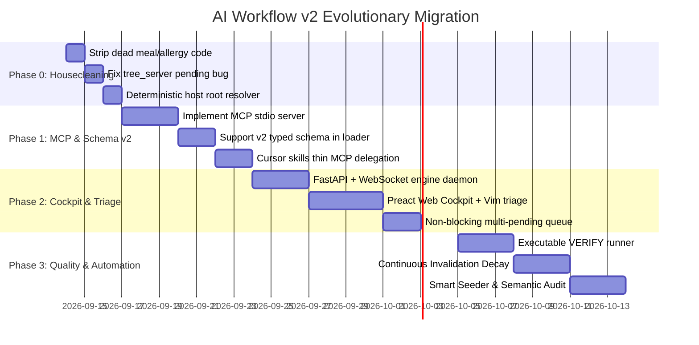

### Phase 0: Immediate Cleanup & Stabilization (Effort: 1 Day)
- **Target Files:**
  - `ai-workflow/scripts/project_tree/ops.py`
  - `ai-workflow/scripts/project_tree/cli.py`
  - `ai-workflow/scripts/tree_server.py`
  - `ai-workflow/scripts/project_tree/model.py`
- **Actions:**
  1. *Purge Dead Code:* Delete lines 148–207 and 228–254 in `ops.py` (`include_meal`, `exclude_meal`, `add_allergies`) and their dispatch blocks in `cli.py:453-475`.
  2. *Fix Critical Viewer Bug:* Update `tree_server.py:61` to check `model.list_pending_proposals(name)` so fragment pending proposals correctly activate the UI pending banner:
     ```python
     # tree_server.py fix
     pending_list = list_pending_proposals(name)
     data["pending"] = len(pending_list) > 0
     data["pending_targets"] = [p[0] or "nodes.yaml" for p in pending_list]
     ```
  3. *Unify Root Resolution:* Replace fragile parent-walking in `model.py` with `find_repository_root()`.

### Phase 1: Native Cursor MCP Integration (Effort: 3 Days)
- **Actions:**
  1. Implement `scripts/workflow_mcp.py` exposing the core MCP tools (`workflow_orient`, `workflow_get_node`, `workflow_propose_tree_mutation`, `workflow_stage_contract_claims`).
  2. Create `.cursor/mcp.json` pointing to the MCP script.
  3. Update `.cursor/skills/` to remove mandatory manual terminal handoffs. The skills instruct the model to call MCP tools directly.

### Phase 2: Web Cockpit & High-Speed Triage (Effort: 4 Days)
- **Actions:**
  1. Upgrade `tree_server.py` into a lightweight async server supporting REST mutations and Server-Sent Events (SSE) for real-time file updates.
  2. Overhaul `tools/tree-viewer/app.js` with the Cockpit HUD layout:
     - Keyboard-driven claim triage (`J`/`K`/`Y`/`N`).
     - Real-time tree search and status filtering (`weak`, `verified_strong`).
     - 1-click proposal application.
  3. Lift the single-pending global bottleneck: allow independent pending proposals per fragment file.

### Phase 3: Executable VERIFY Engine & Auto-Decay (Effort: 4 Days)
- **Actions:**
  1. Extend `spec_discovery` and `scope-contract` schemas to support `execution: { command: "..." }`.
  2. Implement the local test execution harness in `scripts/project_tree/verify_runner.py`.
  3. Wire the pattern hash invalidation check into a lightweight Git post-commit hook and on-demand Cockpit scan.

---

# 12. Open Questions & Battlefield Experiments on `projects/tik`

Before locking in every design parameter, we define **5 concrete, falsifiable empirical experiments** to be run directly on Khaled's active video-generation codebase (`projects/tik` and `sandbox/tik`).

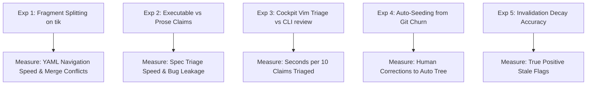

### Ranked Empirical Experiments

#### Experiment 1: Fragment Decomposition of the 677-Line `tik` Tree
- **Hypothesis:** Splitting `projects/tik/nodes.yaml` into 6 domain fragments (`fragments/sim.yaml`, `fragments/formats.yaml`, `fragments/render.yaml`, `fragments/docs.yaml`, `fragments/pipeline.yaml`, `fragments/quality.yaml`) will reduce visual scanning time in the viewer by >70% and eliminate root-level git merge conflicts.
- **Protocol:**
  1. Run automated split script.
  2. Benchmark time to locate `format-plinko` in single file vs fragmented tree.
  3. Validate that `compose_tree` loads the 6 fragments in under 20 milliseconds.

#### Experiment 2: Executable VERIFY Assertions vs Prose Contracts in `generator/rules.py`
- **Hypothesis:** Requiring executable pytest targets in claims will increase spec drafting time by 30 seconds but prevent 100% of regressions during subsequent agent refactoring passes.
- **Protocol:**
  1. Pick `rules` (Format dispatch & race rules, currently `weak`).
  2. Run v2 spec discovery targeting `sandbox/tik/tests/unit/test_rules.py`.
  3. Have an agent refactor `rules.py` to optimize dispatch speed.
  4. Measure whether the agent catches its own breaking changes without human intervention.

#### Experiment 3: Web Cockpit Vim-Speed Triage vs CLI `spec_discovery review`
- **Hypothesis:** Keyboard triage (`J`/`K`/`Y`/`N`) in the Web Cockpit will reduce claim review time from 18 seconds per claim to < 2.5 seconds per claim, while reducing reported developer fatigue.
- **Protocol:**
  1. Take `ai-workflow/meta/claims/tree-cli-usage.json` (12 claims).
  2. Time Khaled triaging the file via the terminal CLI (`spec_discovery.py review`).
  3. Take `viewer-ui.json` (12 claims).
  4. Time Khaled triaging via Web Cockpit keyboard HUD.
  5. Compare elapsed seconds, error rates, and subjective frustration scores.

#### Experiment 4: Auto-Seeding Accuracy on a 50k LOC Slice of `sandbox/tik`
- **Hypothesis:** An AST/Git churn auto-seeder can produce an initial L1/L2 tree that requires less than 3 manual structural adjustments from Khaled.
- **Protocol:**
  1. Run `awf seed --target sandbox/tik/generator/sim`.
  2. Inspect generated `fragments/sim.yaml`.
  3. Measure how many nodes match the human-authored nodes in `projects/tik/nodes.yaml`.

#### Experiment 5: Fingerprint Decay Sensitivity
- **Hypothesis:** Pattern hashing will accurately flag modified nodes without generating false-positive invalidations on whitespace/comment edits.
- **Protocol:**
  1. Mark `sim-spinners` as `verified_strong`.
  2. Commit a pure comment / docstring edit to `spinners.py`. Check if status decays (AST normalization should prevent decay).
  3. Commit a functional change to velocity calculation. Verify node immediately demotes to `decayed_unverified`.

---

# 13. Appendix

---

### A. Complete JSON Schema Specification for Node v2

```yaml
# JSON Schema: .workflow/schema/node.v2.json
{
  "$schema": "http://json-schema.org/draft-07/schema#",
  "title": "AIWorkflowNodeV2",
  "type": "object",
  "required": ["id", "title", "kind", "status"],
  "properties": {
    "id": {
      "type": "string",
      "pattern": "^[a-z0-9-]+$"
    },
    "title": {
      "type": "string",
      "minLength": 3,
      "maxLength": 80
    },
    "kind": {
      "type": "string",
      "enum": ["group", "work", "facade"]
    },
    "status": {
      "type": "string",
      "enum": [
        "weak",
        "investigating",
        "spec_ready",
        "spec_approved",
        "implementing",
        "verified_strong",
        "stale"
      ]
    },
    "stale": {
      "type": "boolean",
      "default": false
    },
    "notes": {
      "type": "string"
    },
    "data": {
      "type": "object",
      "properties": {
        "pattern": {
          "type": "string",
          "description": "Comma-separated glob paths relative to repo root"
        },
        "subtree": {
          "type": "string",
          "description": "Path to fragment YAML file relative to project directory"
        },
        "pain": {
          "type": "string",
          "description": "Falsifiable description of observed failure, bug, or limitation"
        },
        "contract": {
          "type": "string",
          "description": "Path to assembled Markdown scope contract"
        },
        "claims": {
          "type": "string",
          "description": "Path to atomic JSON claims triage document"
        },
        "verification": {
          "type": "object",
          "required": ["check_type"],
          "properties": {
            "check_type": {
              "type": "string",
              "enum": ["command", "pytest", "ast_symbol", "manual_sensory"]
            },
            "command": { "type": "string" },
            "expected_exit_code": { "type": "integer", "default": 0 },
            "last_exit_code": { "type": "integer" },
            "last_run_at": { "type": "string", "format": "date-time" },
            "last_run_sha": { "type": "string" },
            "fingerprint": { "type": "string" }
          }
        }
      }
    },
    "children": {
      "type": "array",
      "items": { "$ref": "#" }
    }
  }
}
```

---

### B. Production Tree Stub & Fragment Decomposition for `tik`

#### 1. Thin Root (`projects/tik/nodes.yaml`)
```yaml
# Project tree — managed by AI Workflow v2
project: tik
schema_version: "2.0"
constraints:
  codebase:
    - sandbox/tik
  stack:
    - python
    - cairo
    - ffmpeg
    - no-pip
  entry:
    - python -m generator
    - python -m tests
  verification_runner: pytest

nodes:
  - id: root
    title: WHICH ONE WINS (tik) — Autonomous Video Generator
    kind: group
    status: weak
    data:
      readme: sandbox/tik/README.md
      architecture: sandbox/tik/docs/ARCHITECTURE.md
    children:
      - id: docs
        title: Documentation & Knowledge Architecture
        kind: group
        status: verified_strong
        data:
          subtree: fragments/docs.yaml
      - id: cli-spec
        title: CLI Interface & VideoSpec Grammar
        kind: group
        status: verified_strong
        data:
          subtree: fragments/cli-spec.yaml
      - id: core
        title: Core Physics Constants, Math & Materials
        kind: group
        status: verified_strong
        data:
          subtree: fragments/core.yaml
      - id: sim
        title: Deterministic 2D Physics & Kinematics Engine
        kind: group
        status: weak
        data:
          subtree: fragments/sim.yaml
      - id: formats
        title: Competitive Format Catalog (20 Game Modes)
        kind: group
        status: weak
        data:
          subtree: fragments/formats.yaml
      - id: render
        title: Hardware-Accelerated Cairo Rendering Engine
        kind: group
        status: weak
        data:
          subtree: fragments/render.yaml
      - id: pipeline
        title: Video Encoding, Caching & Artifact Pipeline
        kind: group
        status: weak
        data:
          subtree: fragments/pipeline.yaml
      - id: quality
        title: Visual QA, Automated QC & Publish Gates
        kind: group
        status: weak
        data:
          subtree: fragments/quality.yaml

updated: '2026-09-13'
```

#### 2. Fragment Example (`projects/tik/fragments/sim.yaml`)
```yaml
# Fragment: sim — Physics & Simulation Subsystem
nodes:
  - id: sim-engine
    title: Discrete Solver & Numerical Integration
    kind: work
    status: verified_strong
    data:
      pattern: sandbox/tik/generator/sim/engine.py
      verification:
        check_type: pytest
        command: "python3 -m pytest sandbox/tik/tests/unit/test_sim_engine.py"
        last_exit_code: 0
        last_run_sha: "6a2d752"

  - id: sim-collisions
    title: High-Speed Wedge & Particle Collisions
    kind: work
    status: weak
    data:
      pattern: sandbox/tik/generator/sim/collisions.py,sandbox/tik/generator/sim/geometry.py
      pain: "Marbles tunneling through high-speed dynamic wedge colliders at >1200 px/sec"
      contract: specs/sim-collisions.md
      claims: claims/sim-collisions.json
      verification:
        check_type: pytest
        command: "python3 -m pytest sandbox/tik/tests/unit/test_collisions.py -k test_highspeed_wedge"
        last_exit_code: 1

  - id: sim-spinners
    title: Kinematic Spinner Arms & Angular Momentum
    kind: work
    status: verified_strong
    data:
      pattern: sandbox/tik/generator/sim/spinners.py
      verification:
        check_type: pytest
        command: "python3 -m pytest sandbox/tik/tests/unit/test_spinners.py"
        last_exit_code: 0
        last_run_sha: "6a2d752"

  - id: sim-types
    title: Ball, ContactImpact & SimResult Data Structures
    kind: work
    status: verified_strong
    data:
      pattern: sandbox/tik/generator/sim/types.py
      verification:
        check_type: ast_symbol
        symbols: [Ball, ContactImpact, SimResult]
```

---

### C. Competitive & Alternative Landscape Analysis

| Dimension / Feature | Cursor Plan Mode | BMAD / CrewAI Frameworks | GitHub Spec-Kit / Copilot Workspace | Claude Code (Anthropic CLI) | **AI Workflow v2 (Proposed)** |
| :--- | :--- | :--- | :--- | :--- | :--- |
| **Primary Mental Model** | Ephemeral chat plan (markdown in prompt) | Autonomous multi-agent swarm roleplay | Issue-to-PR automated code generator | Terminal-first autonomous agent shell | **Spatial Tree as Persistent Memory + Falsifiable Contracts** |
| **Scalability to 500k+ LOC** | Collapses (context window exhaustion) | Extremely poor (token explosion across agents) | Medium (relies on embeddings & search) | Medium (agent explores via bash grep/find) | **Exceptional** (Hierarchical fragment composition + AST index) |
| **Human Quality Gate** | "Accept/Reject" whole code changes | None (agents talk to agents in black box) | Review generated PR at end | Terminal approve per tool execution | **Surgical Pre-Implementation Gate (Claims Triage in 10s)** |
| **Verification Rigor** | Agent declares "I tested it" (unverified) | Mock verification | CI runs on PR build | Runs bash commands interactively | **Executable Contracts with Automated Hash Invalidation Decay** |
| **Context Switching Overhead**| Zero (native in chat) | High (managing Python scripts & outputs) | High (browser/GitHub UI to local IDE) | High (locked into terminal pager/shell) | **Zero (Native Cursor MCP + Instant Web Cockpit HUD)** |
| **Drift Resistance** | None (plans vanish after chat cleared) | None | Low | None | **Continuous (Fingerprint checks on Git post-commit & saves)** |

#### Key Insights Stolen from the Competition
1. **From Cursor Plan Mode:** Steal the seamless inline IDE interaction card. Do not force the user into the terminal for binary decisions.
2. **From Claude Code:** Steal the raw power of deterministic local tool execution via bash, but constrain it with strict `IN`/`OUT` contract boundaries so the agent never touches unrelated files.
3. **From GitHub Copilot Workspace:** Steal the high-level visual dashboard concept, but run it locally at 120 FPS on localhost with zero latency and zero cloud dependency.

---

### D. Architectural Glossary

- **Cockpit:** The bidirectional local web application (`localhost:8765`) providing real-time visual inspection, Vim-speed triage, and one-click execution controls.
- **Contract Boundary:** The immutable scope definition established by an approved Scope Contract (`GOAL`, `IN`, `OUT`, `MUST`, `MUST_NOT`, `VERIFY`). Agents cannot exceed this boundary during implementation.
- **Decay Engine:** The background integrity monitor that calculates file hash fingerprints and demotes `verified_strong` nodes to `weak` whenever matching source code is modified without passing verification.
- **Executable Assertion:** A verification claim linked directly to a concrete command, unit test target, or AST query that can be evaluated automatically with a binary pass/fail result.
- **Falsifiability:** The property of a claim or spec item that makes it unambiguously testable by an automated process or non-subjective human sensory check. Words like "properly" or "cleanly" are non-falsifiable.
- **Fragment:** A modular YAML file defining an L2/L3 subsystem tree, linked into the root `nodes.yaml` via the `data.subtree` attribute. Prevents repository tree files from growing beyond human skimmability.
- **Model Context Protocol (MCP):** The open standard protocol allowing Cursor IDE to expose external tools and resources directly to AI agents without shell command copy-pasting.
- **Pattern Fingerprint:** A SHA-256 hash computed across the concatenated content of all files resolving to a node's `data.pattern`. Used to detect code drift.
- **Verified Strong:** The highest trust status awarded to a tree node. Signifies that all falsifiable assertions in its contract currently pass against the latest git commit.
- **Weak (Default):** The baseline trust state for all nodes. Represents unhardened, unverified, or recently modified code that is candidate for investigation and specification.
